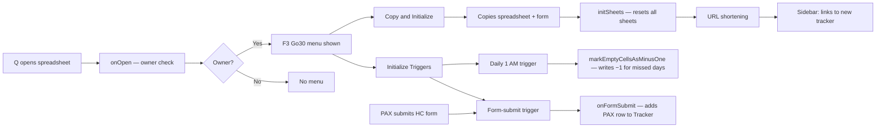

# F3Go30

> **Scale note:** This project uses a condensed single-file documentation structure.
> See CLAUDE.md §Scaling Threshold for when and how to expand to the Standard tier.

Google Apps Script automation for managing monthly Go30 fitness challenge trackers in Google Sheets.

---

## CONTEXT — Why + What

### Introduction & Goals

**Purpose**
F3Go30 automates the monthly lifecycle of a Go30 fitness challenge tracker: copying a template spreadsheet, linking a Google Form for sign-ups, initializing sheets, setting up time and form-submit triggers, and marking missed check-ins nightly. It allows a single Q (site leader) to stand up a new month's tracker in minutes without manual sheet or trigger configuration.

**Quality Goals**

| Priority | Quality Goal | Scenario |
|----------|-------------|----------|
| 1 | Operability | A non-technical site Q can create a new monthly tracker using only the custom menu, without touching Apps Script |
| 2 | Correctness | No PAX entry is duplicated, dropped, or incorrectly marked −1 due to a race condition or range error |
| 3 | Recoverability | If a step in Copy and Initialize fails, the sidebar log surfaces the failure with enough context to recover manually |

**Stakeholders**

| Stakeholder | Expectation |
|-------------|-------------|
| Site Q | Menu-driven workflow; no scripting required |
| PAX (participants) | HC form always linked and accessible; Tracker sheet reflects accurate daily status |
| Developer | Fast context reload; clear module boundaries; known dead code is labeled |

---

### Constraints

**Technical Constraints**
- Runs exclusively in Google Apps Script (V8 runtime); no local execution
- Bound to a specific Google Sheets spreadsheet; cannot run standalone
- Menu access restricted to the spreadsheet owner's Google account
- Google Forms permissions prevent programmatic form ownership transfer across accounts; initial form linking requires a one-time manual step for new regions
- URL shortening requires a TinyURL API token stored as a Script Property; Bitly is supported as an alternative

**Organizational Constraints**
- Single developer; no external CI/CD pipeline
- Deployed by copying files via `clasp` from the `script/` folder

---

### Capabilities
- Copy the active tracker spreadsheet to a new named spreadsheet in the same Drive folder
- Initialize all sheets in a new tracker for the target month and start date
- Link and title the associated Google Form HC sign-up
- Shorten tracker and form URLs via TinyURL (or Bitly) and surface them in a notification sidebar
- Set sharing permissions on new tracker to anyone-with-link/edit
- Set up a daily 1 AM trigger to mark empty check-in cells as −1 after a 24-hour grace period
- Set up a form-submit trigger to populate the Tracker sheet when a PAX submits the HC form
- Log all menu-initiated activity to a hidden Activity sheet

---

### Use Cases

### UC-1: Q Creates a New Monthly Tracker

Actor: Site Q (spreadsheet owner)

Preconditions:
- Q is logged in as the Google account that owns the current tracker spreadsheet
- A valid template or current tracker is open

Primary Flow:
1. Q opens the spreadsheet; the F3 Go30 menu appears
2. Q selects "Copy and Initialize"
3. Q enters the new tracker name and start date when prompted
4. Script copies the spreadsheet and HC form to the same Drive folder
5. Script initializes all sheets, sets form title, sets sharing permissions, and shortens URLs
6. Sidebar displays links to the new spreadsheet and form

Alternate Flows:
A1: Q cancels a prompt → script exits cleanly with a sidebar log message
A2: URL shortening fails → script logs the failure and continues with the full URL

Postconditions:
- New tracker spreadsheet exists in Drive with initialized sheets and correct sharing
- Sidebar contains clickable links to the new tracker and HC form

Constraints:
- Only the spreadsheet owner sees the F3 Go30 menu

---

### UC-2: PAX Submits HC Sign-Up Form

Actor: PAX (participant)

Preconditions:
- The HC form is linked to the tracker spreadsheet
- The form-submit trigger has been initialized on the tracker

Primary Flow:
1. PAX opens the HC form link and submits their goal and F3 name
2. Form response lands in the Responses sheet
3. Form-submit trigger fires `onFormSubmit`
4. Script checks for a duplicate F3 name in the Tracker sheet
5. If not a duplicate, adds a new row with the PAX's data, copies formulas from the prior row, and sorts

Alternate Flows:
A1: F3 name already exists in Tracker → submission is ignored; no duplicate row added
A2: Fewer than 4 form fields present → function exits without writing

Postconditions:
- PAX row exists in the Tracker sheet, sorted and formula-populated

Constraints:
- Deduplication is by F3 name only; name collisions between distinct PAX are possible

---

### UC-3: Nightly Miss Marking

Actor: Time-based trigger (1 AM daily)

Preconditions:
- Daily trigger has been initialized on the tracker
- Tracker sheet has date columns in row 3

Primary Flow:
1. Trigger fires `markEmptyCellsAsMinusOne` at 1 AM
2. Script finds the column for two days prior (grace period)
3. For each PAX row, if the cell is empty, writes −1

Postconditions:
- All PAX who did not record a value within the grace period have −1 in the appropriate column

Constraints:
- Only cells in the two-day-prior column are evaluated; current and yesterday columns are not touched

---

### Non-Goals
- Not a multi-region coordination platform; each region operates its own independent spreadsheet
- Not a public SaaS; no web app, API, or external hosting
- Does not automate the initial one-time form linking step when bootstrapping a new region
- Does not send email or push notifications directly; notification sidebar is in-session only
- No automated testing or CI/CD pipeline

---

### Glossary

| Term | Definition |
|------|------------|
| PAX | Participant in an F3 workout or Go30 challenge |
| HC | Hard Commit — a formal commitment by a PAX to participate; submitted via Google Form |
| Q | Leader of an F3 workout or challenge session; in this context the site Q manages the Go30 tracker |
| Site Q | The Q responsible for a specific F3 region's Go30 instance; typically the spreadsheet owner |
| Go30 | A 30-day F3 fitness challenge tracked in Google Sheets |
| FNG | Friendly New Guy — a first-time F3 participant |
| Tracker sheet | The primary worksheet in the Go30 spreadsheet; one row per PAX, one column per day |
| Bonus Tracker | A secondary sheet where PAX log bonus-point activities (EH, Fellowship, Inspiration, Q) |
| Responses sheet | Google Form response destination sheet; source data for `onFormSubmit` |
| Help sheet | Sheet containing operational URLs (e.g., Next Month HC Signup link) |
| Activity sheet | Hidden sheet logging all script-initiated actions with timestamp and user |
| Template | The canonical Go30 spreadsheet from which new monthly trackers are copied |

---

## DESIGN — How

### Solution Strategy

The tool follows a **copy-from-template** pattern: a working spreadsheet (and its bound form) is duplicated rather than built from scratch each month. This avoids the complexity of programmatically creating Google Forms with correct ownership — a restriction Google Apps Script does not fully support across accounts. The owner-only menu gate enforces that only the authorized Q can trigger destructive or structural operations. A sidebar notification panel (rather than `alert()` dialogs) allows the script to stream progress updates during long-running copy operations without blocking execution.

Programmatic form generation was explored but deferred — the Google Forms API does not support ownership transfer, making full automation impossible for cross-account regional bootstrapping. See ADR-004.

---

### Runtime Architecture

---

### Building Block View

| Module | Files | Responsibility |
|--------|-------|---------------|
| Entry Points | `onOpen.js`, `macros.js` | Custom menu, trigger initialization, legacy macro entry points |
| Tracker Lifecycle | `CreateNewTracker.js`, `addResponseOnSubmit.js`, `markMinusOne.js` | Copy-and-init workflow, form-submit handler, nightly miss marking |
| UI / Notifications | `NotificationSBCode.js`, `NotificationSidebar.html` | Sidebar panel: log streaming, prompts, HTML link generation |
| Utilities | `logActivity.js`, `urlShortener.js`, `Utilities.js` | Activity logging, URL shortening (TinyURL/Bitly), cell utilities |
| Experimental (dead code) | `formManager.js` | Incomplete programmatic form import/export — not called in production; see ADR-004 |

**Note — macros.js:** Contains `startNewMonth()` / `initTriggers()` entry points that partially overlap with `onOpen.js` and `addResponseOnSubmit.js`. This is a legacy layer flagged for cleanup. See PLAN.md §Backlog.

---

### Runtime View

Key edge cases and known risks:

| Scenario | Risk | Status |
|----------|------|--------|
| `initSheets()` called without arguments from `macros.js` | Signature mismatch — will throw at runtime if `startNewMonth()` is used | Known bug — see PLAN.md |
| Tracker has fewer than 4 rows when `onFormSubmit` runs | `getRange` throws on negative row count | Known risk — guard needed |
| URL shortener returns non-200 | Error is caught but not surfaced with actionable message | Known gap |
| `NoticePrompt` receives empty string | `while (!response)` loop treats empty string as no response | Known quirk |

---

### Data Model

| Sheet | Purpose | Key Columns |
|-------|---------|-------------|
| Tracker | One row per PAX; daily check-in grid | A: F3 Name, Row 3: dates (MM/dd/yyyy), data rows 4+ |
| Responses | Raw Google Form submission data | Col 4 (index 3): F3 Name, Col 6: Team |
| Help | Operational links and config values | A: Label, B: URL |
| Bonus Tracker | PAX bonus-point activity log | PAX-entered; not script-managed |
| Activity | Hidden audit log of script actions | A: Datetime, B: User email, C: Message, D: Sheet name |

---

## OPERATIONS — Run + Recover

### Deployment

Script files live in `script/` and are pushed to Google Apps Script via `clasp push` run from the `script/` folder. The script is bound to a specific Google Sheets spreadsheet; there is no standalone deployment.

### Configuration

**Script Properties** (set in Apps Script Project Settings → Script Properties)

| Property | Required | Default | Description |
|----------|----------|---------|-------------|
| `TINYURL_ACCESS_TOKEN` | Yes (for URL shortening) | None | TinyURL API token |
| `BITLY_ACCESS_TOKEN` | No | None | Bitly API token; only needed if switching from TinyURL |

### Running

All operations are initiated from the **F3 Go30** custom menu in Google Sheets. The menu is visible only when the spreadsheet is opened by the owner account.

| Menu Item | Function | When to Use |
|-----------|----------|------------|
| Copy and Initialize | `copyAndInit()` | Start of each new month |
| Initialize Triggers | `initializeTriggers()` | After opening the new tracker for the first time |
| Reinitialize this spreadsheet | `reinitializeSheets()` | Development or reset |
| Run test function (DEV) | `testFunction()` | Developer use only |

### Failure Modes

| Failure | Symptom | Recovery |
|---------|---------|---------|
| Menu does not appear | User is not the spreadsheet owner | Open with the owner account |
| URL shortening fails | Sidebar shows full URL instead of short URL | Check `TINYURL_ACCESS_TOKEN` in Script Properties; use full URL manually |
| Copy and Initialize stops mid-run | Sidebar log shows last completed step | Note the step; complete remaining steps manually using Apps Script editor |
| Tracker not populated after HC form submit | Row missing after form submit | Verify form-submit trigger exists in Apps Script Triggers panel; re-run "Initialize Triggers" |
| −1 not appearing for missed days | Nightly trigger not firing | Verify daily trigger for `markEmptyCellsAsMinusOne` in Triggers panel; re-run "Initialize Triggers" |
| `initSheets` throws on new month | Error from `macros.js` `startNewMonth()` path | Do not use `startNewMonth()`; use "Reinitialize this spreadsheet" from the menu instead |
