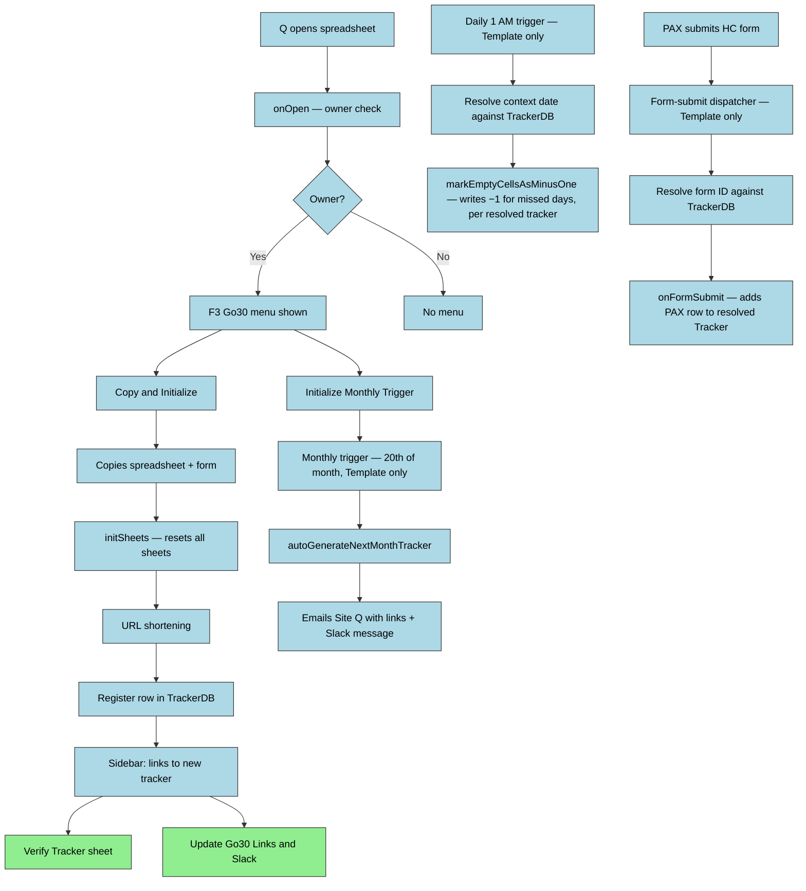

# DESIGN — F3Go30

## Solution Strategy

Spreadsheet creation follows a **copy-from-template** pattern: a working spreadsheet (and its
bound form) is duplicated rather than built from scratch each month. New tracker names are
auto-generated as `YYYY-MM-NameSpace` (e.g. `2026-04-F3Waxhaw`) using the start date and the
`NameSpace` value from the Config sheet; operators are not prompted for a name. This avoids the
complexity of programmatically creating Google Forms with correct ownership — a restriction
Google Apps Script does not fully support across accounts. The owner-only menu gate enforces that
only the authorized Q can trigger destructive or structural operations. A sidebar notification
panel (rather than `alert()` dialogs) allows the script to stream progress updates during
long-running copy operations without blocking execution.

Programmatic form generation was explored but deferred — the Google Forms API does not support
ownership transfer, making full automation impossible for cross-account regional bootstrapping.
See ADR-004.

**Script execution is centralized** (ADR-010): only the spreadsheet-creation step above produces
a new physical spreadsheet. All triggers, dispatch, and logic run exclusively in the Template's
bound script. A monthly tracker copy is registered for execution by adding a row to `TrackerDB`
(spreadsheet ID, form ID, active date range) — it does not get its own triggers. Centrally-run
functions resolve "which spreadsheet do I operate on" by looking up a **context date** against
`TrackerDB`, then call `SpreadsheetApp.openById()` on the resolved target. This also means Script
Properties (Axiom token, GasLogger config, URL-shortener keys) are configured once, on the
Template, and are visible to every dispatched operation — they previously had to be re-entered
per copy because `SpreadsheetApp.copy()` never duplicates Script Properties.

---

## Runtime Architecture

---

## Building Block View

### Level 1 — System Overview

| Module | Files | Responsibility |
|--------|-------|---------------|
| Entry Points | `onOpen.js`, `macros.js` | Custom menu, legacy macro entry points |
| Tracker Lifecycle | `CreateNewTracker.js`, `addResponseOnSubmit.js`, `markMinusOne.js`, `nag.js` | Copy-and-init workflow, form-submit handler, nightly miss marking, daily reminder email workflow — all triggers installed once on the Template and dispatching by `TrackerDB` lookup (ADR-010) |
| Dispatch / TrackerDB | `go30tools.js` | `TrackerDB`/`PaxDB` schema, cross-tracker aggregation, and (per ADR-010) the context-date → target-spreadsheet resolution used by every centrally-dispatched function |
| Web Apps | `WebApp.js`, `signupWebapp.js`, `SignupApp.html`, `dashboardWebapp.js`, `CheckinApp.html` | `doGet`/`doPost` dispatcher by `cmd` query param (`signup`, `checkin`, `admin`); each `cmd` renders its own `HtmlService` template and handles its own `action`-keyed POST body. `signupWebapp.js`/`SignupApp.html` = HC sign-up; `dashboardWebapp.js`/`CheckinApp.html` = daily check-in + PAX dashboard, reading/writing the current month's Tracker sheet directly (no separate data store) |
| UI / Notifications | `NotificationSBCode.js`, `NotificationSidebar.html` | Sidebar panel: log streaming, prompts, HTML link generation |
| Utilities | `logActivity.js`, `urlShortener.js`, `Utilities.js` | Activity logging, URL shortening (TinyURL/Bitly), cell utilities, Config sheet reads |

**macros.js:** Contains `startNewMonth()` and `initTriggers()` entry points that partially overlap
with `onOpen.js` and `addResponseOnSubmit.js`. This is a legacy layer flagged for cleanup
(F3Go30-j1t).

---

## Runtime View

Known code-level risks:

| Scenario | Risk | Status |
|----------|------|--------|
| `initSheets()` called without arguments from `macros.js` | Signature mismatch — throws at runtime if `startNewMonth()` is invoked | Known bug — F3Go30-j1t |
| Tracker has fewer than 4 rows when `onFormSubmit` runs | `getRange` throws on negative row count | Guard added — F3Go30-x82 |
| URL shortener returns non-200 | Error caught but fallback URL not surfaced with actionable message | Known gap |
| `autoGenerateNextMonthTracker` installed on wrong spreadsheet | If installed on a monthly tracker instead of the template, copies from that tracker not the template | Install monthly trigger only on the template spreadsheet |
| Reminder workflow design vs current code | `sendNagEmail` exists, but current code still uses the `Inspiration` sheet and ad hoc body text rather than the resolved `FunFacts`-based reminder template and finalized content model | Known drift — `F3Go30-559`, `F3Go30-ul1`, `F3Go30-agl` |
| Ambiguous or missing `TrackerDB` row match for a context date | A `TrackerDB` row with a duplicate StartDate, or no row at all covering a given date, leaves dispatch with no defined target | `resolveTrackerDbRowForContextDate_` (go30tools.js) throws rather than silently picking a row or no-op'ing (F3Go30-vr80) — an operator error (bad/missing `TrackerDB` row) still surfaces as a logged failure, not a misdirected write |

---

## Crosscutting Concepts

### Notification and Logging

Two logging channels serve different execution contexts:

- **Sidebar (`NoticeLog`, `NoticeLogInit`, `NoticePrompt`)** — active only after `NoticeLogInit()`
  opens the sidebar. Used inside `copyAndInit()` and `reinitializeSheets()`. Messages enqueue to
  `TO_CLIENT` PropertiesService; silently discarded if no sidebar is open.
- **Apps Script Logger (`Logger.log`)** — always available. Required for all trigger-fired and
  background functions (`onFormSubmit`, `markEmptyCellsAsMinusOne`, `autoGenerateNextMonthTracker`).
  Since these now run only in the Template (ADR-010), Logger output and `GasLogger`/Axiom sinks
  are visible in one place for every tracker's activity, not scattered across per-copy projects.

`NoticeLog()` mirrors to `Logger.log()` (HTML-stripped) regardless of sidebar state. Functions
that cannot guarantee a sidebar context must call `Logger.log()` directly.

## Decisions (short)

- **PAX motivation data source (F3Go30-r1b) — DECIDED:** Use the `FunFacts` sheet as the motivation source. Reminder emails will include a randomly-selected entry from the `FunFacts` sheet when personalization is desired. This removes the need for an additional per-person profile submission for basic motivational text; code must implement a random-row selector and include the chosen text in the email payload.

- **Notification scope (F3Go30-a45) — DECIDED:** Notification scope is *team* by default. Reminder emails will be addressed to the team (whole tracker or sub-team when a Team column is present), but the system MUST filter recipients to include only members who have explicitly opted in via the `NAG email?` response column on the HC form (opt-in consent). The reminder trigger implementation must consult the Responses/Preferences data to honor consent before sending any emails.

- **Current implementation note:** `nag.js` already sends a basic team-scoped nag email to opted-in recipients. That implementation is only partial: it currently pulls quote text from the `Inspiration` sheet and uses direct body construction rather than the resolved `FunFacts`-based reminder template. Documentation and implementation should treat this as in-progress behavior, not the final design.

- **Dashboard/check-in identity (F3Go30-ln1x) — DECIDED:** The check-in web app identifies a PAX
  by F3 Name + Email — the same pair the sign-up web app already uses — rather than adding a
  password. No password concept exists anywhere else in the data model; reusing the pair keeps a
  single trust boundary and lets `resolveCheckinIdentity_` reuse `signupWebapp.js`'s
  anti-enumeration `findSignupMatch_` check unchanged. Trade-off: no stronger authentication than
  "knows the PAX's name and email" — acceptable for this internal, low-sensitivity data.

- **Dashboard team grouping (F3Go30-ln1x) — DECIDED:** "My Team" and the PAX board group by
  whatever string currently lives in the Tracker's column B (Goal/Team), not a separately
  maintained team roster — there is no fixed team list in the data model. A group is exactly the
  set of PAX sharing that value at read time; renaming a PAX's team moves them to a new group on
  the next dashboard load with no migration step.

---

## Data Model

| Sheet | Purpose | Key Columns |
|-------|---------|-------------|
| Tracker | One row per PAX; daily check-in grid | A: F3 Name, B: Team/Goal (VLOOKUP), G: Raw Score, H: Score, columns I+ (row 3 header): a `Date` value = day column (PAX-entered 1/0, or −1 after nightly marking), the literal string `'Bonus'` = weekly bonus column (row 2 holds its period number, formula-computed); data rows 4+. `dashboardWebapp.js`'s `classifyTrackerColumns_` reads row 2/row 3 to tell day columns from bonus columns rather than hardcoding column letters |
| Responses | Raw Google Form submission data | Col 4 (index 3): F3 Name, Col 6: Team |
| Config | Runtime configuration read by the script | A: variable name, B: primary value, C: secondary value |
| Help | Operational links and config values | A: Label, B: URL |
| Bonus Tracker | PAX bonus-point activity log | PAX-entered; not script-managed |
| Activity | Hidden audit log of script actions | A: Datetime, B: User email, C: Message, D: Sheet name |
| TrackerDB | Template-resident registry of every monthly tracker (formerly a separate `Links` sheet — consolidated, SheetId-keyed); aggregates cross-tracker metrics and (ADR-010) resolves which spreadsheet a centrally-dispatched function should target for a given context date | Date Modified, StartDate, SpreadsheetName, ShortTracker, TrackerURL, ShortHC, HC URL, SheetId, FormId, TotalPAX, TotalTeams, AverageScore, LastSignupAt, TriggersInitializedAt, LastMinusOneRunAt, LastNagRunAt |
| PaxDB | Template-resident aggregate of individual PAX records across all trackers | Sheet ID, date, F3 Name, team, goal data, hit/miss/no-checkin stats |

## References

- [Sheet reference](docs/sheet-reference.md) — per-sheet layout, formulas, and operational notes referenced by runtime modules
- ADR-004 (form ownership decision)
- README.md (in-repo single-file canonical documentation)
- docs/framework/doc-standard.md (documentation standards and templates)
