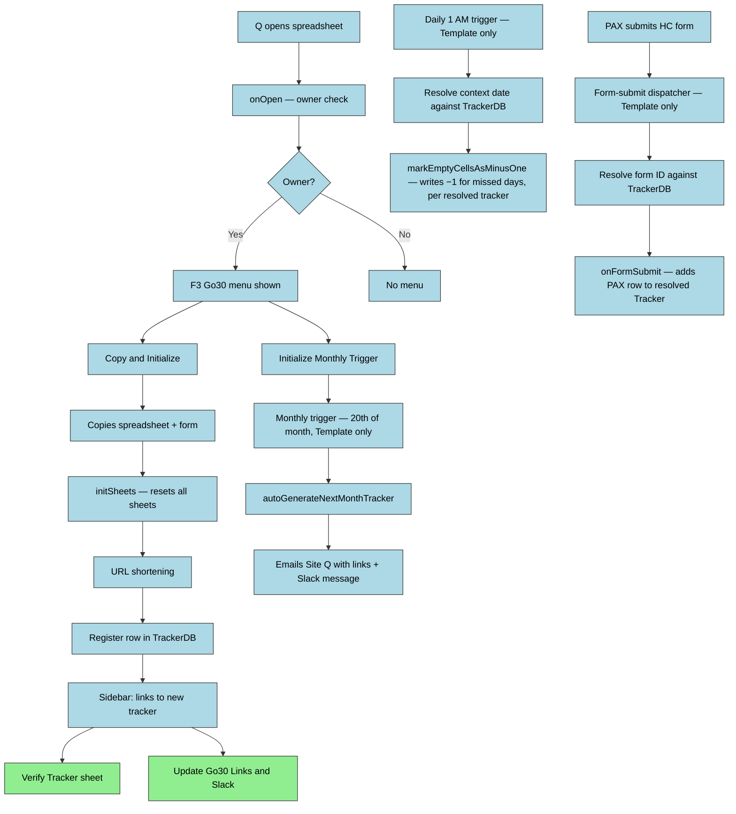

# DESIGN — F3Go30

## Solution Strategy

Spreadsheet creation follows a **copy-from-template** pattern: a working spreadsheet (and its
bound form) is duplicated rather than built from scratch each month. New tracker names are
auto-generated as `YYYY-MM-NameSpace` (e.g. `2026-04-F3Waxhaw`) using the start date and the
`NameSpace` value from the Config sheet; operators are not prompted for a name. This avoids the
complexity of programmatically creating Google Forms with correct ownership — a restriction
Google Apps Script does not fully support across accounts. The owner-only menu gate enforces that
only the authorized Q can trigger destructive or structural operations. A sidebar notification
panel (rather than `alert()` dialogs) allows the script to stream progress updates during
long-running copy operations without blocking execution.

Programmatic form generation was explored but deferred — the Google Forms API does not support
ownership transfer, making full automation impossible for cross-account regional bootstrapping.
See ADR-004.

**Script execution is centralized** (ADR-010): only the spreadsheet-creation step above produces
a new physical spreadsheet. All triggers, dispatch, and logic run exclusively in the Template's
bound script. A monthly tracker copy is registered for execution by adding a row to `TrackerDB`
(spreadsheet ID, form ID, active date range) — it does not get its own triggers. Centrally-run
functions resolve "which spreadsheet do I operate on" by looking up a **context date** against
`TrackerDB`, then call `SpreadsheetApp.openById()` on the resolved target. This also means Script
Properties (Axiom token, GasLogger config, URL-shortener keys) are configured once, on the
Template, and are visible to every dispatched operation — they previously had to be re-entered
per copy because `SpreadsheetApp.copy()` never duplicates Script Properties.

---

## Runtime Architecture

---

## Building Block View

### Level 1 — System Overview

| Module | Files | Responsibility |
|--------|-------|---------------|
| Entry Points | `onOpen.js` | Custom menu |
| Tracker Lifecycle | `CreateNewTracker.js`, `CopyTemplate.js`, `addResponseOnSubmit.js`, `markMinusOne.js`, `nag.js` | Copy-and-init workflow, template-copy mechanics, form-submit handler, nightly miss marking, daily reminder email workflow — all triggers installed once on the Template and dispatching by `TrackerDB` lookup (ADR-010) |
| Dispatch / TrackerDB | `go30tools.js` | `TrackerDB`/`PaxDB` schema, cross-tracker aggregation, and (per ADR-010) the context-date → target-spreadsheet resolution used by every centrally-dispatched function |
| Web Apps | `WebApp.js`, `signupWebapp.js`, `SignupApp.html`, `dashboardWebapp.js`, `CheckinApp.html`, `IdentityCore.html`, `HomeApp.html`, `bonusWebapp.js` | `doGet`/`doPost` dispatcher by `cmd` query param (`signup`, `checkin`, `admin`); each `cmd` renders its own `HtmlService` template and handles its own `action`-keyed POST body. `signupWebapp.js`/`SignupApp.html` = HC sign-up; `dashboardWebapp.js`/`CheckinApp.html` = daily check-in + PAX dashboard, reading/writing the current month's Tracker sheet directly (no separate data store); `bonusWebapp.js` = bonus-list/add/edit actions under the same `checkin` cmd; `IdentityCore.html` = client-side identity/HTTP plumbing shared by both `SignupApp.html` and `CheckinApp.html` (see `include_()` below); no `cmd` (or an unrecognized one) renders `HomeApp.html`, a landing page linking to sign-up, check-in/dashboard, and the current month's tracker spreadsheet |
| Identity / Check-in | `IdentityToken.js` | Bookmarkable identity-token flow — issues and resolves a per-PAX token so a returning PAX can reload the check-in/dashboard page without re-entering F3 Name + Email each visit; see the token/redirect/bookmark-fallback decision below |
| Bonus Rules | `BonusTypes.js` | Centralized bonus-type registry (rule definitions: points, link requirement, cap) consumed by `dashboardWebapp.js`/`bonusWebapp.js` chip rendering and validation |
| Email | `onboardingEmail.js`, `responseSettingsEmail.js`, `signupEmail.js`, `signupReuse.js` + matching `*Template.html` files | Site-Q onboarding email, response-settings confirmation email, sign-up confirmation email, and repeat-signup detection/reuse |
| UI / Notifications | `NotificationSBCode.js`, `NotificationSidebar.html` | Sidebar panel: log streaming, prompts, HTML link generation |
| Utilities | `logActivity.js`, `urlShortener.js`, `Utilities.js`, `libSheets.js`, `response_utils.js`, `PaxCache.js`, `GasLogger.js`, `logFile.js`, `version.js` | Activity logging, URL shortening (TinyURL/Bitly), cell utilities, Config sheet reads, sheet-access helpers, response-parsing helpers, PAX lookup caching, Axiom log sink, log-file download support, version/About constants |

---

## Runtime View

Known code-level risks:

| Scenario | Risk | Status |
|----------|------|--------|
| Tracker has fewer than 4 rows when `onFormSubmit` runs | `getRange` throws on negative row count | Guard added — F3Go30-x82 |
| URL shortener returns non-200 | Error caught but fallback URL not surfaced with actionable message | Known gap |
| `autoGenerateNextMonthTracker` installed on wrong spreadsheet | If installed on a monthly tracker instead of the template, copies from that tracker not the template | Install monthly trigger only on the template spreadsheet |
| Ambiguous or missing `TrackerDB` row match for a context date | A `TrackerDB` row with a duplicate StartDate, or no row at all covering a given date, leaves dispatch with no defined target | `resolveTrackerDbRowForContextDate_` (go30tools.js) throws rather than silently picking a row or no-op'ing (F3Go30-vr80) — an operator error (bad/missing `TrackerDB` row) still surfaces as a logged failure, not a misdirected write |
| A smoke or expired tracker spreadsheet left in the active spreadsheet's Drive folder | `scanTrackers()`'s folder walk scanned anything tracker-shaped with no filtering, so a stray smoke/expired file would land in `TrackerDB`/`PaxDB` as if real | `_qualifySourceFiles_` excludes by name (`(Smoke)`/`(Expired)`) and by `SMOKE_TRACKER_ID` match; headless runs log a warning and exclude, never silently include (F3Go30-xj1q.2) |

---

## Crosscutting Concepts

### Notification and Logging

Two logging channels serve different execution contexts:

- **Sidebar (`NoticeLog`, `NoticeLogInit`, `NoticePrompt`)** — active only after `NoticeLogInit()`
  opens the sidebar. Used inside `copyAndInit()` and `reinitializeSheets()`. Messages enqueue to
  `TO_CLIENT` PropertiesService; silently discarded if no sidebar is open.
- **Apps Script Logger (`Logger.log`)** — always available. Required for all trigger-fired and
  background functions (`onFormSubmit`, `markEmptyCellsAsMinusOne`, `autoGenerateNextMonthTracker`).
  Since these now run only in the Template (ADR-010), Logger output and `GasLogger`/Axiom sinks
  are visible in one place for every tracker's activity, not scattered across per-copy projects.

`NoticeLog()` mirrors to `Logger.log()` (HTML-stripped) regardless of sidebar state. Functions
that cannot guarantee a sidebar context must call `Logger.log()` directly.

## Decisions (short)

- **PAX motivation data source (F3Go30-r1b) — DECIDED:** Use the `FunFacts` sheet as the motivation source. Reminder emails will include a randomly-selected entry from the `FunFacts` sheet when personalization is desired. This removes the need for an additional per-person profile submission for basic motivational text; code must implement a random-row selector and include the chosen text in the email payload.

- **Notification scope (F3Go30-a45) — DECIDED:** Notification scope is *team* by default. Reminder emails will be addressed to the team (whole tracker or sub-team when a Team column is present), but the system MUST filter recipients to include only members who have explicitly opted in via the `NAG email?` response column on the HC form (opt-in consent). The reminder trigger implementation must consult the Responses/Preferences data to honor consent before sending any emails.

- **Current implementation status:** `nag.js` sends a team-scoped nag email to opted-in recipients and pulls motivational text from the `FunFacts` sheet, per the decision above.

- **Dashboard/check-in identity (F3Go30-ln1x) — DECIDED:** The check-in web app identifies a PAX
  by F3 Name + Email — the same pair the sign-up web app already uses — rather than adding a
  password. No password concept exists anywhere else in the data model; reusing the pair keeps a
  single trust boundary and lets `resolveCheckinIdentity_` reuse `signupWebapp.js`'s
  anti-enumeration `findSignupMatch_` check unchanged. Trade-off: no stronger authentication than
  "knows the PAX's name and email" — acceptable for this internal, low-sensitivity data.

- **Bookmarkable check-in link via token + top-level redirect (IdentityToken.js, CheckinApp.html,
  SignupApp.html) — DECIDED:** After a typed `identify` succeeds on either app, the client never
  renders the next step itself from that response — it always hands off via a top-level
  navigation (`attemptTopRedirect_`, a `window.top.location.href` assignment, escaping the GAS
  sandbox iframe the same way a real `target="_top"` link click does): check-in hands off to a
  `?cmd=checkin&id=<identityToken>` URL so a PAX ends up on — and can bookmark / Add to Home
  Screen — a link that skips the name+email form on future visits; sign-up's current-month save
  hands off the same way into that same tokened check-in URL. Because that top-level navigation
  is triggered from script after an async API call rather than directly from the click, some
  browsers block it (lost "user activation"); a 400ms fallback timer (`attemptTopRedirect_`'s
  `fallback` arg) detects the no-op and reveals a manual link/button carrying the same target
  URL — the PAX taps it themselves, a real user-initiated navigation that browsers don't block.
  Once on the tokened check-in URL, a one-time nudge (`#bookmarkHereNote`, gated by the
  server-computed `recentlyMinted` flag on the token's own mint timestamp — no client storage
  needed) tells the PAX to bookmark this page; it does not reappear on later visits to the same
  bookmarked link. `attemptTopRedirect_`, plus the rest of the identity/HTTP client plumbing
  both apps share (`saveIdentityToStorage_`/`loadIdentityFromStorage_`, `callApi`,
  `hideApiError_`, `setButtonLoading_`), was consolidated (F3Go30-xj1q.1) into one
  `IdentityCore.html` `<script>`-only partial, pulled into both `SignupApp.html` and
  `CheckinApp.html` via a new `include_(filename)` helper (`WebApp.js`,
  `HtmlService.createHtmlOutputFromFile(filename).getContent()`) — each page sets
  `var CMD_ = 'signup'|'checkin'` before the include so the shared `callApi()` posts to the
  right `?cmd=` endpoint. `showApiError_` was deliberately left page-specific (not extracted):
  a line-by-line diff of the two originals found it isn't actually identical — `CheckinApp`'s
  error banner includes a Site-Q mailto contact link that `SignupApp`'s doesn't — and collapsing
  it would have been a user-visible behavior change on one page or the other.

- **Check-in PaxDB fallback into sign-up (F3Go30-xj1q.1) — DECIDED:** A PAX known to the
  historical `PaxDB` roster (signed up in a prior month) but absent from the CURRENT month's
  Tracker no longer hits a dead end on check-in. `handleCheckinIdentify_`
  (`dashboardWebapp.js`), on a `resolveCheckinIdentity_` miss, now also calls
  `findPaxDbMatch_` (`signupWebapp.js`, reused unchanged) requiring an EXACT match on both F3
  Name and Email — the same anti-enumeration boundary the sign-up app's own `identify` already
  exposes, so this doesn't open a new probing surface. A hit returns
  `{ matched:false, knownPaxNotRegistered:true, f3Name, email }` — deliberately omitting
  team/goals, since sign-up re-fetches its own prefill via the shared localStorage handoff. This
  fallback is wired into the **miss branch only** (`resolveCheckinIdentity_` returning
  unmatched), never the **tokenInvalid branch** (a saved link that fails to verify — tampered,
  stale, or the PAX's roster entry changed): that branch's `f3Name`/`email` are decoded from an
  unverified client-supplied token payload, and a PaxDB lookup there would let a broken/guessed
  token probe PaxDB for names+emails without ever needing a valid signup. `CheckinApp.html`
  auto-redirects a `knownPaxNotRegistered` response into sign-up via the existing
  `attemptTopRedirect_`/localStorage handoff, landing on
  `?cmd=signup&targetMonth=current&autoStart=1` (mirroring the dashboard's existing "Sign up for
  next month" nudge, `openSignup_('current')`) — with a manual "Sign up" button as the
  redirect-blocked fallback. Sign-up itself needed zero changes: its existing
  `autoStart`+localStorage prefill path (`SignupApp.html`) already covers this hand-off.

- **Dashboard team grouping (F3Go30-ln1x) — DECIDED:** "My Team" and the PAX board group by
  whatever string currently lives in the Tracker's column B (Goal/Team), not a separately
  maintained team roster — there is no fixed team list in the data model. A group is exactly the
  set of PAX sharing that value at read time; renaming a PAX's team moves them to a new group on
  the next dashboard load with no migration step.

- **scanTrackers source qualification (F3Go30-xj1q.2) — DECIDED:** `scanTrackers()`
  (`go30tools.js`) walks the active spreadsheet's sibling Drive folder (same boundary for the
  Template, SIT, or any CopyTemplate-copied environment) and now runs every file found through
  `_qualifySourceFiles_` before scanning: a name containing `(Smoke)`/`(Expired)`, or a SheetId
  matching the current `SMOKE_TRACKER_ID` script property (`SmokeMode.js`), is excluded by
  default — mirroring the filter `CopyTemplate.js`'s `selectRecentRealTrackerRows_` already
  applies to `TrackerDB` rows, but applied to the raw folder walk instead. Headless callers
  (the `runScanTrackers` admin action, any future time trigger) get silent exclusion plus one
  `GasLogger.log('scanTrackers.smokeArtifactsExcluded', ...)` warning enumerating what was
  skipped — never a prompt. `scanTrackers(opts)` also accepts `opts.interactive === true` for a
  future UI-context caller (e.g. an `onOpen` menu item): when smoke/expired artifacts are found
  it prompts per-artifact via `ui.alert(YES_NO_CANCEL)` — YES = include, NO = exclude (default),
  CANCEL = remove (calls `cleanupTrackerArtifact_`, the same removal logic
  `WebApp.js`'s `cleanupTracker` admin action uses, extracted into `go30tools.js` so the two
  entry points can't drift). No `onOpen` menu item calls `scanTrackers(...)` yet — that wiring
  is left to F3Go30-xj1q.3's planned collapse of `CopyTemplate`'s bespoke rebuild onto
  `scanTrackers` as the single populate path.

- **CopyTemplate safe-Config defaults + rename (F3Go30-xj1q.3) — DECIDED:**
  `copyTemplateToNewEnvironment_` (`CopyTemplate.js`) stands up a realistic-prod-data test/SIT
  environment by copying the Template (+ bound script) and recent trackers verbatim; the ONLY
  meaningful PROD→test delta it must apply is the Config sheet, so the copy can never be
  mistaken for PROD or silently send live email. `folderName` (operator-supplied) is unified as
  the single identifier for the new environment: it names the Drive folder, the copied
  Template's spreadsheet name suffix, the new Config `NameSpace` value, and the marker appended
  to every copied tracker's name. Right after the Template copy is made (before the tracker
  copy loop), `applySafeConfigDefaults_`/`computeSafeConfigDefaults_` force the copied Config's
  `Email Test Mode` to `Yes` (fail-safe, regardless of what PROD's Config carried) and its
  `NameSpace` to `folderName` — via `upsertConfigSheetRow_` (`Utilities.js`, now exported for
  Node/testing), same primary/secondary Config-row convention used everywhere else. Copied
  historical tracker spreadsheets are renamed via `buildRenamedTrackerName_`, which **appends**
  `" (<folderName>)"` to the source name rather than substituting the NameSpace segment of
  `"YYYY-MM-<oldNs>"` — appending was chosen as the safer default (bead's own design notes):
  it can't collide with or corrupt an unexpected source naming convention and keeps the
  original name fully intact for traceability back to PROD. The module header on
  `CopyTemplate.js` states this vision explicitly so a future maintainer does not "clean up"
  the copy's Config back toward PROD's values and silently re-arm live email. Out of scope for
  this bead (deferred, see the `scanTrackers` entry above): collapsing `CopyTemplate`'s bespoke
  TrackerDB/PaxDB rebuild (`buildCopiedTrackerDbRow_`/`ct_updateTrackerDB`/`ct_updatePaxDB`)
  onto qualified `scanTrackers` as the single populate path.

---

## Data Model

| Sheet | Purpose | Key Columns |
|-------|---------|-------------|
| Tracker | One row per PAX; daily check-in grid | A: F3 Name, B: Team/Goal (VLOOKUP), G: Raw Score, H: Score, columns I+ (row 3 header): a `Date` value = day column (PAX-entered 1/0, or −1 after nightly marking), the literal string `'Bonus'` = weekly bonus column (row 2 holds its period number, formula-computed); data rows 4+. `dashboardWebapp.js`'s `classifyTrackerColumns_` reads row 2/row 3 to tell day columns from bonus columns rather than hardcoding column letters |
| Responses | Raw Google Form submission data | Col 4 (index 3): F3 Name, Col 6: Team |
| Config | Runtime configuration read by the script | A: variable name, B: primary value, C: secondary value |
| Help | Operational links and config values | A: Label, B: URL |
| Bonus Tracker | PAX bonus-point activity log | PAX-entered; not script-managed |
| Activity | Hidden audit log of script actions | A: Datetime, B: User email, C: Message, D: Sheet name |
| TrackerDB | Template-resident registry of every monthly tracker (formerly a separate `Links` sheet — consolidated, SheetId-keyed); aggregates cross-tracker metrics and (ADR-010) resolves which spreadsheet a centrally-dispatched function should target for a given context date | Date Modified, StartDate, SpreadsheetName, ShortTracker, TrackerURL, ShortHC, HC URL, SheetId, FormId, TotalPAX, TotalTeams, AverageScore, LastSignupAt, TriggersInitializedAt, LastMinusOneRunAt, LastNagRunAt |
| PaxDB | Template-resident aggregate of individual PAX records across all trackers | Sheet ID, date, F3 Name, team, goal data, hit/miss/no-checkin stats |

## References

- [Sheet reference](docs/sheet-reference.md) — per-sheet layout, formulas, and operational notes referenced by runtime modules
- ADR-004 (form ownership decision)
- README.md (in-repo single-file canonical documentation)
- docs/framework/doc-standard.md (documentation standards and templates)
