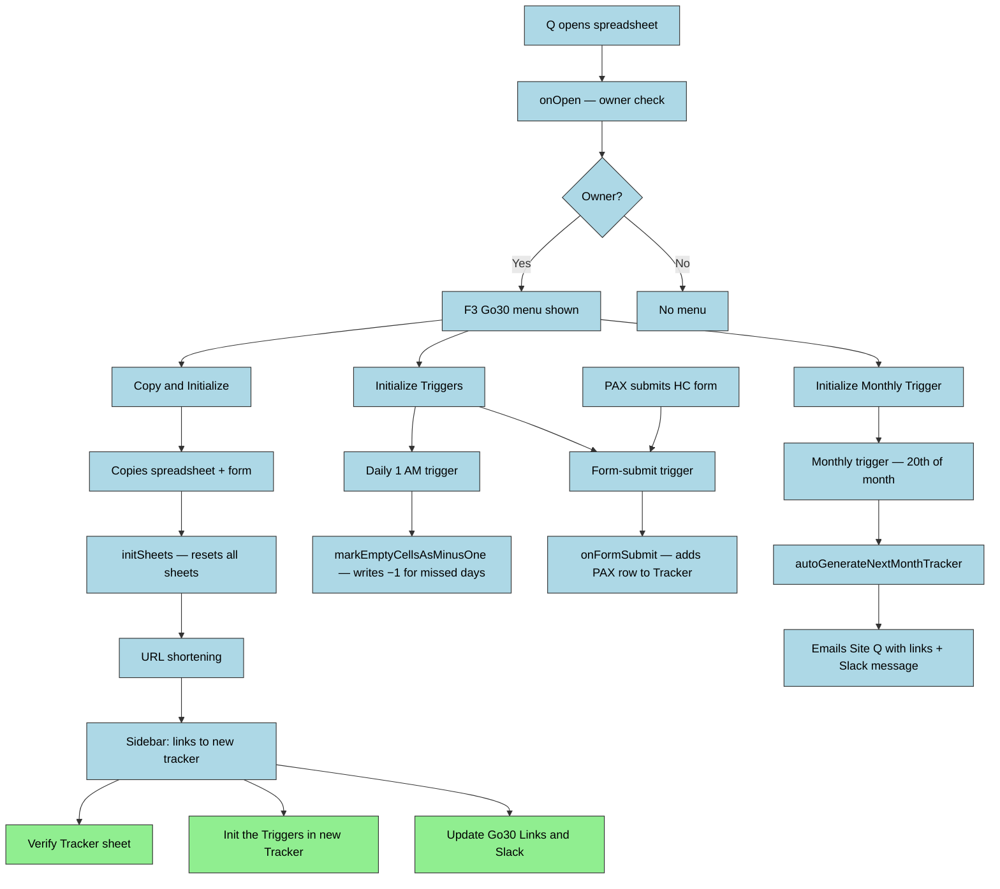

# DESIGN — F3Go30

## Solution Strategy

The tool follows a **copy-from-template** pattern: a working spreadsheet (and its bound form) is
duplicated rather than built from scratch each month. New tracker names are auto-generated as
`YYYY-MM-NameSpace` (e.g. `2026-04-F3Waxhaw`) using the start date and the `NameSpace` value
from the Config sheet; operators are not prompted for a name. This avoids the complexity of
programmatically creating Google Forms with correct ownership — a restriction Google Apps Script
does not fully support across accounts. The owner-only menu gate enforces that only the authorized
Q can trigger destructive or structural operations. A sidebar notification panel (rather than
`alert()` dialogs) allows the script to stream progress updates during long-running copy
operations without blocking execution.

Programmatic form generation was explored but deferred — the Google Forms API does not support
ownership transfer, making full automation impossible for cross-account regional bootstrapping.
See ADR-004.

---

## Runtime Architecture

---

## Building Block View

### Level 1 — System Overview

| Module | Files | Responsibility |
|--------|-------|---------------|
| Entry Points | `onOpen.js`, `macros.js` | Custom menu, trigger initialization, legacy macro entry points |
| Tracker Lifecycle | `CreateNewTracker.js`, `addResponseOnSubmit.js`, `markMinusOne.js`, `nag.js` | Copy-and-init workflow, form-submit handler, nightly miss marking, daily reminder email workflow |
| UI / Notifications | `NotificationSBCode.js`, `NotificationSidebar.html` | Sidebar panel: log streaming, prompts, HTML link generation |
| Utilities | `logActivity.js`, `urlShortener.js`, `Utilities.js` | Activity logging, URL shortening (TinyURL/Bitly), cell utilities, Config sheet reads |

**macros.js:** Contains `startNewMonth()` and `initTriggers()` entry points that partially overlap
with `onOpen.js` and `addResponseOnSubmit.js`. This is a legacy layer flagged for cleanup
(F3Go30-j1t).

---

## Runtime View

Known code-level risks:

| Scenario | Risk | Status |
|----------|------|--------|
| `initSheets()` called without arguments from `macros.js` | Signature mismatch — throws at runtime if `startNewMonth()` is invoked | Known bug — F3Go30-j1t |
| Tracker has fewer than 4 rows when `onFormSubmit` runs | `getRange` throws on negative row count | Guard added — F3Go30-x82 |
| URL shortener returns non-200 | Error caught but fallback URL not surfaced with actionable message | Known gap |
| `autoGenerateNextMonthTracker` installed on wrong spreadsheet | If installed on a monthly tracker instead of the template, copies from that tracker not the template | Install monthly trigger only on the template spreadsheet |
| Reminder workflow design vs current code | `sendNagEmail` exists, but current code still uses the `Inspiration` sheet and ad hoc body text rather than the resolved `FunFacts`-based reminder template and finalized content model | Known drift — `F3Go30-559`, `F3Go30-ul1`, `F3Go30-agl` |

---

## Crosscutting Concepts

### Notification and Logging

Two logging channels serve different execution contexts:

- **Sidebar (`NoticeLog`, `NoticeLogInit`, `NoticePrompt`)** — active only after `NoticeLogInit()`
  opens the sidebar. Used inside `copyAndInit()` and `reinitializeSheets()`. Messages enqueue to
  `TO_CLIENT` PropertiesService; silently discarded if no sidebar is open.
- **Apps Script Logger (`Logger.log`)** — always available. Required for all trigger-fired and
  background functions (`onFormSubmit`, `markEmptyCellsAsMinusOne`, `autoGenerateNextMonthTracker`).

`NoticeLog()` mirrors to `Logger.log()` (HTML-stripped) regardless of sidebar state. Functions
that cannot guarantee a sidebar context must call `Logger.log()` directly.

## Decisions (short)

- **PAX motivation data source (F3Go30-r1b) — DECIDED:** Use the `FunFacts` sheet as the motivation source. Reminder emails will include a randomly-selected entry from the `FunFacts` sheet when personalization is desired. This removes the need for an additional per-person profile submission for basic motivational text; code must implement a random-row selector and include the chosen text in the email payload.

- **Notification scope (F3Go30-a45) — DECIDED:** Notification scope is *team* by default. Reminder emails will be addressed to the team (whole tracker or sub-team when a Team column is present), but the system MUST filter recipients to include only members who have explicitly opted in via the `NAG email?` response column on the HC form (opt-in consent). The reminder trigger implementation must consult the Responses/Preferences data to honor consent before sending any emails.

- **Current implementation note:** `nag.js` already sends a basic team-scoped nag email to opted-in recipients. That implementation is only partial: it currently pulls quote text from the `Inspiration` sheet and uses direct body construction rather than the resolved `FunFacts`-based reminder template. Documentation and implementation should treat this as in-progress behavior, not the final design.

---

## Data Model

| Sheet | Purpose | Key Columns |
|-------|---------|-------------|
| Tracker | One row per PAX; daily check-in grid | A: F3 Name, Row 3: dates (MM/dd/yyyy), data rows 4+ |
| Responses | Raw Google Form submission data | Col 4 (index 3): F3 Name, Col 6: Team |
| Config | Runtime configuration read by the script | A: variable name, B: primary value, C: secondary value |
| Help | Operational links and config values | A: Label, B: URL |
| Bonus Tracker | PAX bonus-point activity log | PAX-entered; not script-managed |
| Activity | Hidden audit log of script actions | A: Datetime, B: User email, C: Message, D: Sheet name |
| Links | Record of every tracker created | Date, start date, name, tracker URL, form URL, spreadsheet ID, form ID |

## References

- [Sheet reference](docs/sheet-reference.md) — per-sheet layout, formulas, and operational notes referenced by runtime modules
- ADR-004 (form ownership decision)
- README.md (in-repo single-file canonical documentation)
- docs/framework/doc-standard.md (documentation standards and templates)
