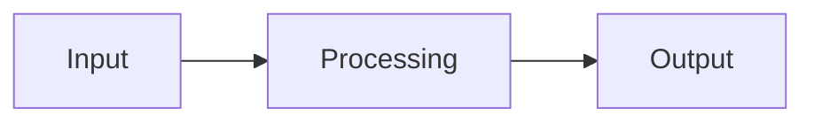

# Repository Documentation Bootstrap Prompt — Minimal Tier

**Use this prompt for:** solo tools, 1–2 modules, single contributor, single runtime boundary.

**Standards reference:** All use case formats, ADR formats, diagramming standards, writing
standards, graduation rules, trigger rules, and story rules are defined in
`doc-bootstrap-standards.md`. Apply them here without modification.

**Do not generate document content until explicitly instructed. Follow phases in order.
Stop at each confirmation gate.**

---

## Objectives

- Developer context reload in ≤10 minutes
- Single-file documentation for fast navigation
- Terminology consistent with Standard and Extended tiers for easy graduation
- Optimized for Claude Code and GitHub Copilot
- Concise, technical writing — no marketing tone

---

## Target Structure

```
README.md
PLAN.md
adr/
docs/
    assets/         [if applicable]
    references/     [if applicable]
CLAUDE.md
```

CONTEXT, DESIGN, and OPERATIONS content lives in README.md under named sections that
mirror the full-scale document names exactly. This preserves terminology consistency and
makes graduation to Standard tier straightforward.

A separate `BACKLOG.md` is optional — use a Backlog section in PLAN.md unless the
backlog becomes unwieldy.

---

## README.md Template

```markdown
# <Tool Name>

> **Scale note:** This project uses a condensed single-file documentation structure.
> See CLAUDE.md §Scaling Threshold for when and how to expand to the Standard tier.

<One sentence description of what this tool does.>

---

## CONTEXT — Why + What

### Introduction & Goals

**Purpose**
<Two to three sentences describing what this tool does and why it exists.>

**Quality Goals**
[If applicable]
| Priority | Quality Goal | Scenario |
|----------|-------------|---------- |
| 1 | <e.g. Safety> | <e.g. No write operation occurs without prior read verification> |
| 2 | <e.g. Operability> | <e.g. A non-technical volunteer can operate the system> |

**Stakeholders**
[If applicable]
| Stakeholder | Expectation |
|-------------|-------------|
| <e.g. Developer> | <e.g. Fast context reload after a break> |
| <e.g. Operator> | <e.g. Clear error messages and recovery steps> |

---

### Constraints

**Technical Constraints**
[If applicable]
- <e.g. Python 3.11+ required>
- <e.g. Must operate without internet access>

**Organizational Constraints**
[If applicable]
- <e.g. Single developer, no external dependencies requiring licenses>

**Regulatory Constraints**
[If applicable]
- <e.g. Must comply with X standard>

---

### Capabilities
- <Durable capability — not sprint story>
- <Durable capability>
[If applicable] - <Additional capability>

---

### Use Cases
[If applicable — include if the tool has distinct actor-driven flows]
<!-- Use standard UC format from doc-bootstrap-standards.md -->

### UC-1: <Short Name>

Actor: <Primary actor>

Preconditions:
- <Condition>

Primary Flow:
1. <Step>
2. <Step>

Postconditions:
- <Resulting system state>

Constraints:
- <Invariant>

---

### Non-Goals
- <What this tool explicitly does not do>
[If applicable] - <Additional non-goal>

---

### Glossary
[If applicable]
| Term | Definition |
|------|------------|
| <Term> | <Definition> |

---

## DESIGN — How

### Solution Strategy
[If applicable — include when the architecture involves non-obvious decisions]
<Short summary of the fundamental decisions that shaped this tool's design.
Why is it structured the way it is? What alternatives were rejected?>

---

### Runtime Architecture
<Brief description of how the tool operates at runtime. Use a Mermaid diagram
if it reduces ambiguity compared to prose.>

[If applicable]


---

### Building Block View
<Description of the one or two modules and what each is responsible for.>

[If applicable]
| Module | Responsibility |
|--------|---------------|
| <module> | <what it does> |

---

### Runtime View
[If applicable — include if error or exception flows are non-obvious]
<Key runtime scenarios: how does the tool behave under normal and error conditions?>

---

### Data Model
[If applicable]
<Description of key data structures. Use erDiagram if relationships are non-trivial.>

---

### References
[If applicable]
| Document | Location | Covers |
|----------|----------|--------|
| <Document name> | <assets/ path or URL> | <What it covers> |

---

## OPERATIONS — Run + Recover

### Deployment
<How this tool is installed and where it runs. Single sentence if simple.>

### Development Environment
[If applicable — include when local setup is not obvious from package config alone]
**Setup:**
```bash
python -m venv .venv
source .venv/bin/activate      # Linux / macOS
.venv\Scripts\activate         # Windows
pip install -e ".[dev]"
```

**Verify:**
```bash
<command that confirms environment is working>
```

[If applicable] See CONTRIBUTING.md for OS-specific or IDE-specific variations.

---

### Configuration

**Environment Variables**
[If applicable]
| Variable | Required | Default | Description |
|----------|----------|---------|-------------|
| <VAR_NAME> | Yes/No | <default> | <description> |

**Configuration File**
[If applicable]
<Location, format, and key options.>

---

### Running
```bash
<command to run the tool>
```
<Any required arguments or flags.>

---

### Failure Modes
[If applicable]
| Failure | Symptom | Recovery |
|---------|---------|---------|
| <e.g. Connection refused> | <e.g. OSC timeout error> | <e.g. Verify device is powered and on network> |

---
```

**Size target:** ≤800 words. If exceeded, review the scaling threshold.

---

## PLAN.md Template

```markdown
# Plan

## Status
<Current phase or milestone — one sentence. e.g. "Phase 2 complete — write
verification implemented. Starting Phase 3 dry-run mode.">

## In Progress
- <Item> [— branch or PR reference if using PRs]
[If applicable] - <Item>

## Next
- <Item>
[If applicable] - <Item>

## Blocked
[If applicable]
- <Item> — <blocker>

## Open Decisions
[If applicable]
- <Decision needed> — <specific question>

## Recent Findings
[If applicable]
- <Observation not yet extracted to permanent home>

## Backlog
[If applicable — move to BACKLOG.md if this table grows beyond ~10 rows]
| # | Item | Type | Priority | Notes |
|---|------|------|----------|-------|
| 1 | <Item> | Story/Bug/Decision/Debt/Research | High/Med/Low | <note> |
```

**Size target:** ≤400 words. If exceeded, extract content to permanent documents.

Types: `Story` / `Bug` / `Decision` / `Debt` / `Research`

---

## CLAUDE.md Template

```markdown
# CLAUDE.md — <Tool Name>

## Framework Reference
**Tier:** Minimal
**Standards:** /docs/framework/doc-bootstrap-standards.md
**Tier prompt:** /docs/framework/doc-bootstrap-minimal.md
Framework files are read-only. Do not edit in place.

[If applicable]
## Contributing
See CONTRIBUTING.md for developer environment setup variations.

## Reading Order
1. PLAN.md     — current state, what is in flight
2. README.md   — purpose, capabilities, architecture, operations
3. /adr/       — why key decisions were made
[If applicable] 4. /docs/references/ — external document summaries (see index below)

## Document Map
| Content | Location |
|---------|---------|
| Purpose, capabilities, use cases | README.md §CONTEXT |
| Architecture, modules, data model | README.md §DESIGN |
| Installation, configuration, failure modes | README.md §OPERATIONS |
| Current state, backlog | PLAN.md |
| Technical decisions | /adr/ |
[If applicable] | External doc summaries | /docs/references/ |

## Placement Rules
- All new capabilities → README.md §CONTEXT §Capabilities + use case if actor-driven
- All architecture changes → README.md §DESIGN
- All operational changes → README.md §OPERATIONS
- All resolved decisions → /adr/
- All new terms → README.md §CONTEXT §Glossary
- Do not create new top-level document types without reviewing scaling threshold

## Scaling Threshold
Expand to Standard tier when any of these are true:
- README.md exceeds ~800 words
- More than two contributors
- More than one runtime boundary
- Deployment becomes non-trivial
- A subproject relationship emerges

To expand:
1. Create /docs/ with CONTEXT.md, DESIGN.md, OPERATIONS.md, PLAN.md, BACKLOG.md
2. Migrate each README.md section to its corresponding document
3. README.md becomes a brief project intro with pointers to /docs/
4. Run the Standard tier bootstrap prompt to normalize the new structure

## Maintenance Protocol

### Session Start
When asked to review project state, before beginning any work:
1. Read PLAN.md — flag content that appears resolved and should graduate
2. Check README.md size — flag if approaching 800 words
3. Identify open decisions in PLAN.md ready to become ADRs
4. Report findings before proceeding

### Trigger Rules
See doc-bootstrap-standards.md §Trigger Rules

### What Claude Will Not Do Automatically
- Monitor documents between sessions
- Detect drift without being asked
- Update documents without explicit instruction

To trigger a state review: "review project state before we start"

[If applicable]
## Reference Summaries
| File | Source Document | Covers |
|------|----------------|--------|
| references/<name>-summary.md | assets/<source> | <scope> |
```

---

## Phase 1 — Discovery

Read before doing anything else:
- All files in the repository root
- Any existing documentation regardless of name or location
- Any reference PDFs or external documents in the repository

Produce:

**1. Repository Summary**
Two to three sentences: purpose, primary language and framework, deployment model.

**2. Inventory Table**

| File | Inferred Purpose | Target Location | Action |
|------|-----------------|-----------------|--------|

**3. Orphan List**
Content with no clean target location.

**4. Gap Analysis**

| Target Section | Status |
|---------------|--------|
| README.md §CONTEXT — Introduction & Goals | Ready / Needs rewrite / Must be authored |
| README.md §CONTEXT — Constraints | Ready / Needs rewrite / Must be authored / Not applicable |
| README.md §CONTEXT — Capabilities | ... |
| README.md §CONTEXT — Use Cases | ... |
| README.md §CONTEXT — Non-Goals | ... |
| README.md §CONTEXT — Glossary | ... |
| README.md §DESIGN — Solution Strategy | ... |
| README.md §DESIGN — Runtime Architecture | ... |
| README.md §DESIGN — Building Block View | ... |
| README.md §DESIGN — Runtime View | ... |
| README.md §DESIGN — Data Model | ... |
| README.md §OPERATIONS — Deployment | ... |
| README.md §OPERATIONS — Configuration | ... |
| README.md §OPERATIONS — Failure Modes | ... |

**5. Likely ADR Candidates**

| Decision | Current Location | Suggested Status |
|----------|-----------------|-----------------|

**6. External Document Inventory**
[If applicable]

| Document | Location | Format | Action |
|----------|----------|--------|--------|

**7. Scaling Assessment**
Does this project already exceed the Minimal tier threshold? If yes, recommend
running the Standard tier bootstrap prompt instead.

**8. Structural Risks**

| Risk | Detail |
|------|--------|

> **Stop. Confirm inventory, repository summary, and scaling assessment with operator
> before proceeding.**

---

## Phase 1.5 — Disposition Planning

Convert every gap, orphan, and structural risk into an explicit recommendation.
Do not create files or modify content in this phase.

Classify each item using the action types in `doc-bootstrap-standards.md
§Disposition Planning — Action Types`.

Create `/docs/disposition-plan.md` containing:

**Section 1 — Disposition Table**

| # | Item | Source | Recommended Action | Target | Prerequisite | Operator Decision |
|---|------|--------|--------------------|--------|--------------|-------------------|

Leave `Operator Decision` empty. Valid entries:
`Approve` / `Modify: [instruction]` / `Escalate` / `Discard`

**Section 2 — Escalation Block**
[If applicable]
```
Item #:    <Row number>
Item:      <Name>
Question:  <Specific question that must be answered before action is possible>
```

**Section 3 — Processing Instructions**

Include this verbatim at the bottom of `/docs/disposition-plan.md`:

```markdown
## How to Complete This File

1. Review each row in the Disposition Table
2. Add your decision to the `Operator Decision` column:
   - `Approve` — proceed as recommended
   - `Modify: [your instruction]` — proceed with changes you specify
   - `Escalate` — needs discussion before action
   - `Discard` — drop this item entirely
3. Answer each question in the Escalation Block or write `Defer`
4. Save the file then paste the following prompt into Claude Code:

---

### Resume Prompt

I have updated /docs/disposition-plan.md with my decisions.
Please:
1. Read /docs/disposition-plan.md
2. Confirm your understanding of each operator decision
3. Flag any decisions that conflict or create downstream problems
4. Produce a revised disposition table reflecting all modifications
5. Confirm readiness to proceed to Phase 2 — Scaffold Creation
6. Do not begin Phase 2 until I confirm
```

> **Stop. Do not proceed until the operator pastes the Resume Prompt.**

---

## Phase 2 — Scaffold Creation

### Step 1 — Install Framework Files

Copy the following into `/docs/framework/`:
- `doc-bootstrap-standards.md`
- `doc-bootstrap-minimal.md`

Do not copy Standard or Extended tier prompts.

Create `/docs/framework/README.md` using the template in
`doc-bootstrap-standards.md §Framework Installation`.

### Step 2 — Create Document Scaffold

Create README.md with section headers and `[If applicable]` stubs per the template above.
Create PLAN.md, CLAUDE.md, and `/adr/` directory with stubs.

> **Stop. Confirm scaffold with operator before proceeding.**

---

## Phase 3 — Migration Plan

Produce a reviewable migration plan. Do not modify any existing files.

| # | Action | Source | Destination | Notes |
|---|--------|--------|-------------|-------|

Actions: `Rename` / `Migrate` / `Split` / `Summarize` / `Archive` / `Delete`

All replaced documents must be renamed with `-OLD` before content is extracted.

> **Stop. Do not execute. Operator approves before any file is modified.**

---

## Success Criteria

| Criterion | Observable Outcome |
|-----------|-------------------|
| Developer re-entry | Working context reached in ≤10 minutes via PLAN.md |
| Consistent terminology | README.md section headers match tier nomenclature exactly |
| Scaling path clear | CLAUDE.md §Scaling Threshold documents upgrade path |
| AI retrieval | Claude Code locates correct section without ambiguity |
| No empty sections | All placeholder stubs removed from finished documents |
| Migration complete | All `-OLD` files exist; all content has a target or disposition |

---

*Begin with Phase 1. Do not skip phases. Do not generate content before migration plan
is approved.*

---

*Monday, March 02, 2026*
