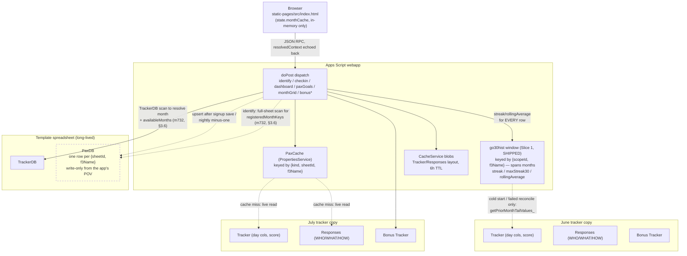
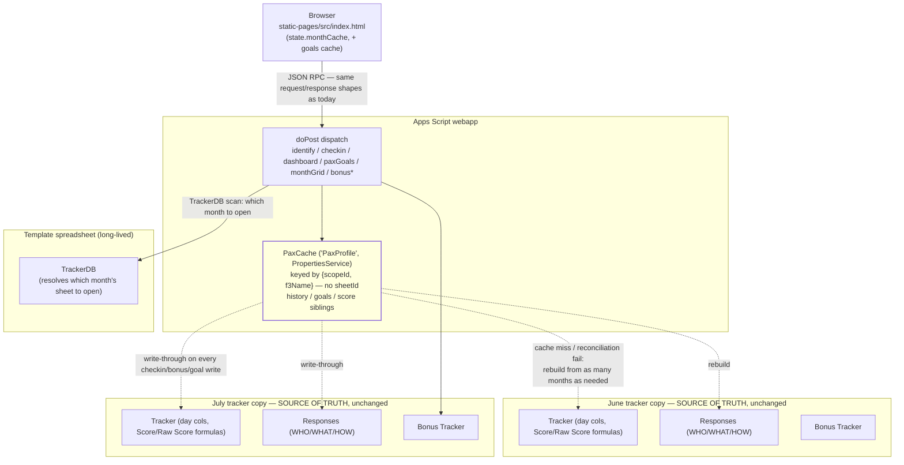

# PAX Data Model & Browser/Server Contract

**Status:** Partly implemented. Slices 1-2 (§5) shipped and are live. **Slice 3 was corrected
2026-08-20/21**: earlier drafts of §3.2/§5 (and a design-gap pass built on top of them) proposed
restructuring `PaxProfile` into a new Template-resident sheet that would become the primary write
target, retiring Tracker/Responses *and* `PaxDB` as sources of truth — none of that was the actual
intent and all of it has been reverted (`PaxDB` in particular is a live, human-consumed monthly
reporting artifact, not dead weight). The corrected model (§3.2, §5's Slice 3): `PaxProfile` is the
existing `PaxCache.js`/`PropertiesService` layer (Slices 1-2's `go30hist:`/`go30goals:`), widened
by Slice 3 to also hold score; the spreadsheet — Tracker, Responses, *and* `PaxDB` — stays the
permanent source of truth at every slice, and writes always write-through to it unchanged. This
began as a discussion document and is now the working design for
an in-flight migration (epic F3Go30-uz9e) — treat §3's record shape and §5.1/§5.2's as-built notes
as binding on implementation, and the rest of §5 as intent that may still change. Not an ADR: if a
future slice ever does commit a real write-path change, promote the settled pieces into
docs/DESIGN.md and raise an ADR per this project's placement rules.

**Section status at a glance:**

| Section | Status |
|---|---|
| §1 Contract | As-built. Unchanged by Slices 1-2, and unchanged by every remaining slice by design. |
| §2 Current data flow | As-built, **corrected for Slice 1** — §2.2/§2.3 previously described pre-Slice-1 behavior. |
| §3 Proposed model | Record shape settled and live end to end (`history`/`goals` shipped as sibling PaxCache entries). §3.2 **corrected 2026-08-20** — no new sheet, spreadsheet stays authoritative. §3.3 (datastore) still speculative. |
| §4 Implementation invariants | As-built. Rules Slice 1 established that Slice 2 preserves and Slice 3 (corrected) doesn't touch — invariant 6 in particular already assumed a permanently-authoritative Tracker. |
| §5 Migration slices | Slices 1-2 **done**; Slice 3 **corrected 2026-08-20/21** — a small cache-widening only (`score` sibling + deeper rebuild), not an authority transfer and not a `PaxDB` change; ready to schedule, no design gate needed. Slice 4 open. |
| §6 Open items | None blocking. `PaxDB` confirmed 2026-08-21 as a live human-reporting artifact — untouched by Slice 3. |

**Scope:** the `cmd=checkin` webapp (identify → check-in → dashboard → bonus/goals) and the
`cmd=signup` webapp (registration + goal capture), covering:
1. The wire contract between browser and server, action by action.
2. Where each piece of data physically lives today (Sheets) and how it's cached (server + client),
   with a before/after diagram (§2.6, §3.4) and a per-store data inventory — object, contents,
   written-by, read-by (§2.7, §3.5). Spreadsheet column-level detail stays in
   `docs/sheet-reference.md`; the inventory here covers the object level plus the two stores
   (`PaxCache`/`CacheService`) and browser state that sheet-reference.md doesn't.
3. A proposed PAX-centric data model, evaluated first on the current spreadsheet store, then on
   a future fast-datastore backend.
4. Suggested migration slices from the current state to the proposed one, with a recommendation
   for where to start (§5).

---

## 1. Current contract: browser ↔ server

Both webapps are Apps Script `doPost` endpoints that dispatch a JSON `{action, ...}` body to a
handler function and return JSON. There is no REST-style resource model — every action is a
named RPC.

### 1.1 `cmd=checkin` actions

| Action | Handler | Purpose |
|---|---|---|
| `identify` | `handleCheckinIdentify_` | Resolve a PAX (by typed name/email or saved session token), return their current-month state |
| `checkin` | `handleCheckinSubmit_` | Write today's/yesterday's/an explicit day's hit-miss-fail value |
| `dashboard` | `handleCheckinDashboard_` | Full team/board view: viewer's own stats + every teammate's tile |
| `paxGoals` | `handlePaxGoals_` | On-demand WHO/WHAT/HOW for one teammate (pax-detail popup) |
| `monthGrid` | `handleMonthGrid_` | Whole-month calendar for one PAX, for date-nav / the Advanced calendar |
| `bonusList` / `bonusAdd` / `bonusEdit` | `handleBonusList_` / `Add` / `Edit` | Bonus Tracker CRUD (Fellowship/Q/Inspire/EH entries) |

#### `identify` request → response

```
→ { action: 'identify', f3Name, email, token?, contextDate? }
← {
    ok: true, matched: true,
    config: { appVersion, bonusTypeRules, bonusTypeCodes, siteQName, siteQEmail, nameSpace },
    emailMismatch, f3Name, email, team, monthLabel,
    goals: { who, what, how },                // current month only, flat, no history
    todayStatus, yesterdayAvailable, yesterdayStatus,
    monthGrid: [ { dateIso, status }, ... ],   // this identify's own tracker month
    nextMonthLabel, nextMonthRegistered,
    availableMonths, registeredMonthKeys,
    firstUse,
    resolvedContext: { sheetId, monthKey, startDateIso, trackerUrl, label, rowIndex, f3Name },
    sessionGuid, ...
  }
```

`resolvedContext` is the load-bearing piece for every later request in the session: the client
echoes it back verbatim on `checkin`/`dashboard`/`paxGoals`/`monthGrid` so the server can skip
`TrackerDB` resolution and the Responses/Tracker identity re-lookup, and go straight to
`{sheetId, rowIndex}`. It is **only ever a hint** — every consumer (`resolveLeanIdentityFromHandle_`,
`resolveFullIdentityFromHandle_`) re-validates that the row at `rowIndex` still names `f3Name`
before trusting it, falling back to full resolution otherwise (a roster edit, a stale handle, or
a wrong-namespace context all degrade safely rather than binding to the wrong PAX).

#### `checkin` request → response

```
→ { action: 'checkin', f3Name, email, day: 'today'|'yesterday', value: 1|0|null|-1,
    explicitDate?, resolvedContext? }
← { ok: true }  |  { ok: false, error: 'not_found'|'day_column_not_found'|'cell_is_formula'|'invalid_value' }
```

Writes one cell in that PAX's Tracker row for that day's column. `-1` (Failed) is only accepted
for a strictly-past date — a defense-in-depth check mirrored from the client's own UI rule.

#### `dashboard` request → response

```
→ { action: 'dashboard', f3Name, dateISO?, resolvedContext? }
← {
    ok: true, f3Name, team, monthLabel, monthKey, trackerUrl,
    currentDay, totalDays, dayDates, viewDayIndex, viewDate,
    streak, maxStreak30,                      // VIEWER ONLY — cross-month-corrected (see §2.3)
    score, rawScore, scorePct, dayValues, daySegments, rollingAverage, priorMonthDayValues,
    done, missed, absent,
    bonusByType, bonusByTypeSeries,
    myTeam: [ paxRow, ... ],                  // same-team tiles
    paxBoard: [ { team, members: [paxRow, ...] }, ... ]  // whole-roster board, grouped by team
  }

  paxRow = { name, team, score, rawScore, streak, maxStreak30, scorePct, dayValues,
             daySegments, bonusByType, bonusByTypeSeries }
```

`streak`/`maxStreak30` inside every `paxRow` (myTeam/paxBoard) are computed from **this month's
Tracker row only** — no cross-month lookback. The top-level `streak`/`maxStreak30` (the viewer's
own) get a second pass (`getPriorMonthTailValues_` + `computeStreak_`/`computeMaxStreak_` over a
windowed prior-month tail) that the team-tile rows never receive. This is the root cause of the
"teammates' streaks look month-truncated" behavior investigated earlier in this thread — see §2.3.

#### `paxGoals` request → response

```
→ { action: 'paxGoals', f3Name, dateISO?, resolvedContext? }
← { ok: true, f3Name, goals: { who, what, how } }   // always "current", no month/date resolution
```

#### `monthGrid` request → response

```
→ { action: 'monthGrid', f3Name, monthKey? | date?, contextDate? }
← { ok: true, monthKey, monthLabel, monthGrid: [ {dateIso, status}, ... ], registered, trackerUrl }
```

Each call to `monthGrid` for a month other than the one `identify` already returned opens that
month's own spreadsheet independently — there is no roster-spanning "give me PAX X across every
month" request anywhere in the contract today.

#### `bonusList` / `bonusAdd` / `bonusEdit`

```
→ bonusList: { action:'bonusList', f3Name, email, dateISO? }
← { ok: true, entries: [...], bonusTypes: [...] }

→ bonusAdd:  { action:'bonusAdd', f3Name, email, type, whenIso, what, link? }
← { ok: true, ... } | { ok: false, error }

→ bonusEdit: { action:'bonusEdit', f3Name, email, rowIndex, original, originalWhenIso, whenIso, type, what, link? }
← { ok: true } | { ok: false, error: 'not_found' }
```

`bonusEdit` relocates by matching `original` (a snapshot of the pre-edit row, as last seen in a
`bonusList` response) against live sheet content, not by trusting `rowIndex` alone — a human
resorting the Bonus Tracker sheet between list and edit can't cause a wrong-row write.

### 1.2 `cmd=signup` actions (relevant subset)

```
→ handleSignupIdentify_: { f3Name, email } → prefill state, including current goals
→ handleSignupSave_:     { f3Name, email, team, teamType, who, what, how, phone, nag, ... }
← { ok: true, savedMonth, trackerUrl, checkinUrl?, identityToken? }
```

`who`/`what`/`how` are plain strings on every save — new registration or "Update my
registration" for an existing one. The server **overwrites** the one Responses-row cell for the
month being saved; there is no timestamp, no version, and no server-side record of what the
value was before the overwrite.

---

## 2. Current data flow & caching

### 2.1 Storage today

Everything lives in Google Sheets. Two spreadsheet lifetimes:

- **Template** (long-lived, one per environment): `TrackerDB` (registry of every monthly
  tracker + cross-tracker aggregates), `PaxDB` (a *separate*, periodically-rebuilt aggregate:
  one row per `{sheetId, f3Name}` holding WHO/WHAT/HOW + Hit/Miss/NoCheckin/bonus-type counts —
  see §2.4), `NamespaceDB`, `CheckinSessions`.
- **Monthly tracker copy** (one Drive file per calendar month, made from the Template):
  `Tracker` (one row per PAX: name, team, score, raw score, one column per day, one column per
  bonus period), `Responses` (signup form data, including WHO/WHAT/HOW for that month), `Bonus
  Tracker` (Fellowship/Q/Inspire/EH entries, date-scoped).

A PAX's day values, score, and goals for month M live **only** in month M's own spreadsheet.

Two things have changed since this section was first written:
- **Slice 1 shipped**, adding the `go30hist:` rolling window (`PaxCache.js`) — the first store that
  spans months for a PAX, and now the live source of every board row's streak/rolling average
  (§2.2). It is `PropertiesService`-backed, not a sheet.
- **`PaxDB` is no longer write-only** — `identify` reads it per request for month participation,
  though not for any of the goal/stat data it exists to hold (§2.4).

`PaxDB` remains one row per PAX-**per-month**, so it still cannot answer "give me PAX X across
every month" without a scan.

### 2.2 Server-side caching

Two independent layers, both Apps Script built-ins, neither a "fast" external datastore:

- **`PaxCache` (`PaxCache.js`)** — backed by `PropertiesService` (no TTL; `CacheService`'s
  6-hour cap is shorter than a PAX's daily check-in cadence, so a TTL cache would miss every
  day). Keyed by `{kind: 'tracker'|'responses', sheetId, f3Name}`. Two shapes per sheet: a
  roster index (normalized name → row offset) and one property per PAX's full row. Freshness
  comes from write-through on every webapp write (`refreshPaxCacheRowFromSheet_dw_`) plus
  `TrackerEditTrigger.js`'s `onEdit`-driven invalidation for manual sheet edits (a monthly
  tracker copy has its own independent script + `PropertiesService` store, so `onEdit` has to be
  installed from the Template's project to reach the shared store at all).
- **Whole-sheet `CacheService` blobs** — Tracker/Responses *layout* (day/bonus column
  classification, 6-hour TTL) and Responses data rows. Separate from PaxCache; carries no
  per-PAX day values.

Both of the above are keyed by `sheetId` (i.e. by month), so every cross-month read against them
is a cache miss into a *different* namespace. That was the original motivation for this whole
document, and Slice 1 has since added a **third** layer that isn't month-keyed:

- **`go30hist:` rolling history window (`PaxCache.js`, Slice 1 — shipped)** — keyed by
  `{scopeId, f3Name}` where `scopeId` is the resolved *template* spreadsheet id (namespace
  identity), **not** a tracker `sheetId`. Holds `{historyEndDate, days}` per §3.1. This is the
  first store in the system that spans months for a PAX, and it is the live source of
  `streak`/`maxStreak30`/`rollingAverage`/`priorMonthDayValues` for **every** board row today.

`getPriorMonthTailValues_` still exists, but its role changed: it is no longer on the normal read
path: it is the **cold-start/rebuild backfill source** for the history window
(`getPaxHistoryWindowValues_`, dashboardWebapp.js:2410), reached only when a PAX has no usable
window yet or the window fails read-time reconciliation. Steady-state reads never touch the prior
month's spreadsheet at all.

### 2.3 Teammates' tile streaks: month-truncation (fixed by Slice 1)

**Historical — this describes the bug that motivated Slice 1, and is no longer current
behavior.** `buildDashboardPaxRow_` used to compute `streak`/`maxStreak30` from `dayValues`
sourced from `identity.trackerValues` — this month's Tracker roster only — for **every** row,
viewer included. Only afterward, for the one matched viewer, did `handleCheckinDashboard_` fetch
`getPriorMonthTailValues_` and recompute `userStreak`/`userMaxStreak30`, overwriting just the
top-level fields. `myTeam`/`paxBoard` never received that correction, so early in a calendar
month every teammate but the viewer showed an artificially short streak.

As shipped (F3Go30-5uk2, F3Go30-uz9e.1), every row — viewer and teammates alike — is computed
from the same `getPaxHistoryWindowValues_` window, and the viewer-only override is gone:
`userStreak`/`userMaxStreak30`/`userRollingAverage` now just read the values off `userRow`
(dashboardWebapp.js:2618-2628). There is no longer a second, viewer-only computation path to keep
in sync — which is the structural win, independent of the bug it fixed.

### 2.4 PaxDB: the cross-tracker aggregate, read live for one narrow purpose

`PaxDB` (go30tools.js) is a Template-resident sheet, one row per `{SheetId, F3 Name}`, columns:
`SheetId, Date, F3 Name, Team, WHO, WHAT, HOW, Comments, Hit, Miss, NoCheckin, Fellowship, Q
Point, Inspire, EHing FNG, Email, Team Type, Other Team, Phone, NAG Email`. It's upserted
incrementally (`upsertPaxDbRow_`, keyed by `{SheetId, F3 Name}`, O(n) linear scan of existing
rows per write — a lock-guarded full-column read, not a cache) after signup saves and after the
nightly minus-one job, and can be fully rebuilt by `scanTrackers()`/a historical rebuild. It is
the closest thing this system already has to a cross-tracker PAX aggregate — but it's still one
row **per month**, not one row per PAX, so it doesn't yet answer "give me PAX X's full history"
without scanning every row that matches their name across however many months exist.

**It is no longer purely write-only.** `buildMonthNavigationPayload_dw_` (dashboardWebapp.js)
reads the whole sheet on every `identify` — an uncapped `getDataRange().getValues()` — but only to
answer one narrow question: which months this PAX has a row for (`registeredMonthKeys`). None of
`PaxDB`'s actual goal/stat payload is consumed. Measured at ~730ms on SIT with a single PAX's
roster and 4 months (F3Go30-bopt); scales with total rows. See §3.6 — this read is exactly what
`PaxProfile.goals` retires.

### 2.5 Client-side caching

No `localStorage`/`sessionStorage` involvement for PAX data at all — `localStorage` is used
**only** for the identity token (`{f3Name, email}`, static-pages/src/index.html — formerly also `IdentityCore.html`, removed by DR-04, 2026-08-04) so a returning visitor
doesn't have to retype who they are; it holds nothing about scores, streaks, or goals.

All PAX-data caching client-side is an in-memory JS object, `state.monthCache`, scoped to the
current page load:

- Populated by `prefetchDashboard_` at identify time, keyed by `monthKey`.
- Write-through patched (`patchOwnDayIntoPayload_`) on the viewer's own check-in submit, so the
  cached payload's `dayValues`/matching `myTeam`/`paxBoard` entries reflect the just-written
  value without a refetch.
- Explicitly invalidated (`invalidateMonthCacheFor_`) for the touched month only, on a
  successful checkin write, so "Continue to Dashboard" re-fetches live data instead of the
  pre-checkin snapshot.
- **`paxGoals` has no client-side cache at all** — every tap of a team tile re-fetches goals from
  the server, even for the same PAX opened twice in one session.

### 2.6 Current state diagram (as of Slice 1)



What this diagram makes visible, as of Slice 1:

1. **`History` is the template for where the whole model is going** — one store, keyed by
   `{scopeId, f3Name}`, spanning months, feeding every board row from one lookup. The prior-month
   spreadsheet read it replaced is now a dotted cold-start edge, not a steady-state dependency.
2. **`PaxCache` proper is still `sheetId`-keyed**, so goals and identity resolution remain
   month-sharded — that is exactly the gap Slices 2-3 close.
3. **`PaxDB` is no longer purely write-only.** `buildMonthNavigationPayload_dw_` reads it on every
   `identify` for `registeredMonthKeys` — a full-sheet scan across every month (§3.6, F3Go30-m732).
   It remains unread for the goal/stat data that is its actual content.

### 2.7 Data inventory: objects, contents, and who touches them (current state)

Full spreadsheet column-by-column schema lives in `docs/sheet-reference.md` — this table stays
at the object level and adds the two stores (`PaxCache`, `CacheService`) and the browser state
that sheet-reference.md doesn't cover, so every box in the §2.6 diagram maps to something
concrete.

**Spreadsheet (Template-resident)**

| Object | Contents | Written by | Read by |
|---|---|---|---|
| `TrackerDB` | One row per monthly tracker: `SheetId`, `StartDate`, URLs, aggregate stats | `CreateNewTracker.js` (new month), `scanTrackers()` (rescan) | `resolveDashboardMonth_`/`resolveTrackerDbRowForContextDate_` on every action that needs to pick a month |
| `PaxDB` | One row per `{SheetId, F3 Name}`: goals + Hit/Miss/NoCheckin/bonus counts (full column list in §2.4) | `upsertPaxDbRow_` (after signup save, after nightly minus-one), `scanTrackers()`/historical rebuild | Reporting/admin tooling, **plus** `buildMonthNavigationPayload_dw_` on every `identify` — full-sheet scan for `registeredMonthKeys` only, none of the goal/stat payload (§2.4, §3.6) |
| `NamespaceDB` | Registry of provisioned namespace environments (ADR-014) | `copyTemplate` admin action | `resolveTemplateSpreadsheet_` (ns resolution on every request) |
| `CheckinSessions` | One row per saved-link session guid: `f3Name`, `email`, created/last-used timestamps | `createOrTouchCheckinSession_dw_` (every `identify`) | `resolveCheckinToken_dw_`/`resolveCheckinSession_dw_` (token-based `identify`) |

**Spreadsheet (per monthly tracker copy)**

| Object | Contents | Written by | Read by |
|---|---|---|---|
| `Tracker` | One row per PAX: name, team, raw/derived score, one column per day, one column per bonus period | `handleCheckinSubmit_` (day cell), Bonus Tracker formulas (score columns), `CreateNewTracker.js` (row creation via form submit) | `handleCheckinDashboard_`, `handleCheckinIdentify_`, `handleMonthGrid_` — every action that reports score/streak/day status |
| `Responses` | One row per PAX signup for that month: WHO/WHAT/HOW, email, team, participation status | `handleSignupSave_`/form submit | `resolveCheckinIdentityLean_`/`Full_` (identity match + goals), `handlePaxGoals_` |
| `Bonus Tracker` | One row per bonus entry: PAX name, type, date, what/link | `handleBonusAdd_`/`handleBonusEdit_` | `handleBonusList_`, `computeBonusSeriesForPax_dw_` (dashboard bonus pills) |

**PropertiesService (`PaxCache.js`)**

| Object | Contents | Written by | Read by |
|---|---|---|---|
| Roster index — `go30idx:{kind}:{sheetId}` | JSON map: normalized name → row offset | `setPaxCacheRowsBulk_dw_` (bulk repopulate on cold roster read) | `buildTrackerValuesFromPaxCache_`, `resolvePaxRowIndex_dw_` |
| Per-PAX row — `go30pax:{kind}:{sheetId}:{f3Name}` | This PAX's full Tracker or Responses row, as last read/written | `setPaxCacheRow_dw_`/`refreshPaxCacheRowFromSheet_dw_` on every checkin/bonus write | Every identity resolver (`resolveCheckinIdentityLean_/Full_`, `resolveLeanIdentityFromHandle_`, `getPriorMonthTailValues_`) |
| **Rolling history window — `go30hist:{scopeId}:{f3Name}`** (Slice 1, shipped) | `{historyEndDate, days}` — dense 1-char/day outcomes, 400-day cap, **spans months**; keyed by namespace + name, *not* by `sheetId` | `advancePaxHistoryDay_` (write-through on every checkin), nightly minus-one job, rebuild path via `getPriorMonthTailValues_` | `getPaxHistoryWindowValues_` → `buildDashboardPaxRow_` for **every** board row: `streak`, `maxStreak30`, `rollingAverage`, `priorMonthDayValues` |

**CacheService**

| Object | Contents | Written by | Read by |
|---|---|---|---|
| Tracker/Responses layout blob (6h TTL) | Row2/row3 header classification (which columns are days vs. bonus) | `getTrackerLayout_`/`getResponsesLayout_` on a cold read | `classifyTrackerColumns_` callers — every action that needs to map a date to a column |
| Responses full-sheet values blob | Whole Responses data-row range, whole-sheet granularity | `setCachedSheetValues_` on `resolveCheckinIdentityFull_`'s cold read | `resolveCheckinIdentityFull_` (dashboard's full-roster identity) |

**Browser (in-memory JS only — no `localStorage`/`sessionStorage` for PAX data)**

| Object | Contents | Written by | Read by |
|---|---|---|---|
| `state.monthCache[monthKey]` | The full `dashboard` response payload for a visited month | `prefetchDashboard_` (populate), `patchOwnDayIntoPayload_` (write-through on own checkin) | `renderDashboard_`, date-nav arrows (cache-hit fast path) |
| `localStorage[IDENTITY_STORAGE_KEY]` | `{f3Name, email}` only — identity prefill, nothing about scores/streaks/goals | static-pages/src/index.html on successful identify | Return-visit prefill on the static front end |
| (none) | Teammate goals (`paxGoals` response) | — | Fetched fresh from the server on every pax-detail popup open, never cached |

---

## 3. Proposed data model

### 3.1 Shape: one record per PAX, not one row per PAX-per-month

```
PaxProfile {
  f3Name,                        // key (normalized; scoped by namespace — see below)
  team, email, phone,
  goals: [
    { monthKey: "2026-06", who, what, how },
    { monthKey: "2026-07", who, what, how }
  ],
  historyEndDate: "2026-08-02",  // ISO date the LAST character of `history` represents
  history: "1101.0X1."           // one char/day, dense-encoded, rolling 400-day window,
                                 // history[0] = historyEndDate - (history.length - 1) days
}
```

**Day encoding (as shipped, `paxHistoryEncodeValue_`):** `'1'` = Hit, `'0'` = Miss, `'X'` = Failed
(the Tracker's `-1`), `'.'` = no data (blank cell, or a gap the window never observed). Failed is
`X`, not `-1` — the encoding is strictly one character per day, so a two-character token would
desynchronize every index after it from its calendar date. (An earlier draft of this document
showed `-1` inline in the example string; that was never implementable.)

**Keying (as shipped):** the live key is `go30hist:{scopeId}:{normalizedF3Name}`, where `scopeId`
is the **resolved template spreadsheet id** — namespace identity per ADR-014, not a tracker
`sheetId`. "Keyed by `f3Name` alone" throughout this document is shorthand for "no month/`sheetId`
dimension"; the namespace dimension stays, and must stay, or two namespaces' PAX of the same name
would collide in one store. Slices 2-3 use the same `{scopeId, f3Name}` scoping.

- **Goals become a small, upsert-by-`monthKey` list**, not a single overwritten value.
  `effectiveAt` is pinned to the 1st of the month a save targets (decided in this thread): a
  re-save within the same month upserts that month's entry (matching today's real
  last-write-wins-within-a-month behavior); a save in a new month appends a new entry. Current
  goals = the entry for the current `monthKey`. Point-in-time reporting = the entry for whatever
  `monthKey` is asked for — a lookup in one small list, not a re-derivation from a month's own
  spreadsheet (which today can't even answer this, since an overwrite destroys the prior value).
- **The `goals` list doubles as the PAX's month-participation index.** A goals entry exists for
  month M exactly when that PAX registered for month M — `upsertPaxDbRow_` (the only writer of a
  `PaxDB` row) is called from `signupWebapp.js` at signup, the same event that captures
  WHO/WHAT/HOW. So `identify`'s `registeredMonthKeys` becomes `goals.map(g => g.monthKey)` off one
  already-cached record, rather than today's full-sheet `PaxDB` scan across every month. This is
  the structural fix for half of F3Go30-m732 — see §3.6.
- **History becomes a single rolling-window string, anchored by an explicit `historyEndDate`.**
  A bare string of day-outcome characters is ambiguous on its own — without a stamped date, there
  is no way to know which calendar day any character represents, especially since the window
  shifts by one day on every write. `historyEndDate` is the record's own statement of "this is
  the most recent day represented" (the character at index 0 is the oldest, one day at a time,
  counting back from `historyEndDate`). Every write (a new day's checkin) advances
  `historyEndDate` and shifts the string in the same operation — the two fields are updated
  together, never independently, so the anchor can never drift out of sync with its data.
  Streak/30-day-best/score are all slices/scans of one field, anchored against `historyEndDate`
  rather than "whatever month happens to be current." This removes the entire "prior month tail"
  cross-namespace-cache-miss pattern (§2.2): there's no other month's cache entry left to reach
  into, because a PAX's timeline is one self-describing record.
- Bounding history to a fixed window (e.g. ~400 days) keeps the record well under any of Sheets'
  cell limit (50k chars) or `PropertiesService`'s per-value limit (9KB) — a dense 1-char/day
  encoding of 400 days is ~400 bytes, comfortably inside either.

### 3.2 On the current store (Sheets) — cache-only, no new sheet

**Corrected 2026-08-20** — see §5's Slice 3 for the full account of what changed and why. This
subsection originally proposed restructuring `PaxDB` into a new one-row-per-`f3Name` `PaxProfile`
sheet and retiring Tracker/Responses as sources of truth. **That was never the actual intent** and
has been reverted; the paragraphs below are the corrected design.

- `PaxProfile` is not a new sheet. It is the name for what `PaxCache.js`'s existing
  `{scopeId, f3Name}`-keyed `PropertiesService` entries already are as of Slices 1-2 (`go30hist:`,
  `go30goals:`), widened by Slice 3 to also hold a `go30score:` sibling (§3.5). Same
  `PropertiesService` write-through mechanism already in place today — nothing new to build here,
  only a third sibling key alongside the two that already ship.
- **The spreadsheet stays authoritative, permanently, at every slice.** `Tracker` day cells and
  its `Score`/`Raw Score` formulas, and `Responses` WHO/WHAT/HOW, are never retired as sources of
  truth. Every write (`checkin`, bonus, goal save) still write-throughs to the Tracker/Responses
  cell exactly as it does today; the cache write is a second, *derived* write in the same request
  — the same relationship `history`/`goals` already have to the Tracker/Responses cell they're
  cached from.
- Reads try the cache first; a miss or a failed reconciliation (invariant 6, §4) rebuilds from the
  Tracker/Responses sheet(s) it was derived from — as many months back as the request actually
  needs, not just the current rolling window. `getPriorMonthTailValues_` is the existing
  one-prior-month version of this; Slice 3 generalizes the same pattern rather than retiring it.
- **Contract impact: none, for the live apps** — unchanged from the original claim. Every existing
  request/response shape (`identify`, `checkin`, `dashboard`, `paxGoals`) stays byte-for-byte the
  same; only the server's internal resolution changes from "read a cell in month M's spreadsheet"
  to "read a cached field, falling back to the spreadsheet(s) on a miss."
- **`PaxDB`'s write path stays — confirmed 2026-08-21, not retiring.** No *code* reads its
  Hit/Miss/NoCheckin/bonus-count payload (§2.4, §3.6 — that remains true), but the sheet is a live
  **human**-consumed reporting artifact: it captures PAX scores per month specifically so a Site Q
  can build monthly reporting summaries directly off it in the sheet UI. A `PropertiesService`
  cache entry can't serve that need — there's nothing to open and browse. `upsertPaxDbRow_`, the
  nightly minus-one upsert, and `scanTrackers()`'s rebuild all keep running unchanged; Slice 3
  does not touch `PaxDB` at all.
- Monthly tracker copies are unaffected by any of this — nothing about the monthly-copy mechanism
  itself (Bonus Tracker period caps, the signup Form binding, admin per-month spreadsheet access
  for Site Qs) changes under this slice; consolidating that mechanism, if ever wanted, remains a
  separate scoping question outside what's been evaluated here.

### 3.3 On a future fast datastore

If/when a real datastore (Firestore-style document store, or a KV store) is available, the same
`PaxProfile` shape drops in unchanged as a document, keyed by `f3Name`:

- `get(f3Name)` / `upsert(f3Name, fields)` replace `getPaxCacheRow_dw_`/`setPaxCacheRow_dw_` —
  same access pattern, different transport. No calling code above the cache-abstraction layer
  needs to change shape, only which library backs `PaxCache.js`'s two functions.
- The rolling-window history string could become a real time-series (one doc per day, or a
  proper array field) once cell-size/row-count constraints no longer apply — but doesn't have to
  on day one; the dense string is forward-compatible (a migration script unpacks it once).
- Team-board reads (`myTeam`/`paxBoard`, currently a `PropertiesService` bulk `getProperties()`
  keyed off a roster index) become a native `WHERE team = X` / batched-get query — the roster
  index concept can retire once the store itself supports querying by field, rather than needing
  a hand-rolled name→row index.
- The contract (§1) still doesn't need to change for this migration — it was already designed
  around "the server resolves whatever it needs and returns the same shape," so swapping what's
  behind `PaxCache.js` is invisible to the static front end either way. The
  migration risk lives entirely in the write paths' consistency guarantees (Sheets' single-writer
  lock semantics vs. a datastore's own transaction model), not in the client contract.

### 3.4 After: proposed state diagram (corrected 2026-08-20 — see §5's Slice 3)



Same contract, same actions — what moved is only where a read/write gets short-circuited by a
cache hit. Tracker/Responses are drawn as **"SOURCE OF TRUTH, unchanged"** deliberately: unlike an
earlier draft of this diagram, nothing here retires them. `getPriorMonthTailValues_` generalizes
into a multi-month rebuild path rather than disappearing — under this model it's still exactly how
a cold cache entry gets populated, just able to reach back further than one prior month. Monthly
tracker copies are entirely unaffected; there was never actually a scoping question here once the
spreadsheet stays authoritative.

### 3.5 Data inventory: objects, contents, and who touches them (Slice 3, corrected 2026-08-20)

Same table shape as §2.7. The spreadsheet tables below are nearly identical to §2.7's, since Slice
3 (corrected) doesn't change the spreadsheet's role at all — only the `PropertiesService` block
(the actual "PaxProfile") gains a sibling entry.

**Spreadsheet (Template-resident)**

| Object | Contents | Written by | Read by |
|---|---|---|---|
| `TrackerDB` | Unchanged | Unchanged | Unchanged |
| `PaxDB` | Unchanged — **stays, confirmed 2026-08-21**. No code reads its goal/stat payload, but it's the source Site Qs build monthly reporting summaries from directly in the sheet UI | Unchanged: `upsertPaxDbRow_`, nightly upsert, `scanTrackers()` rebuild | Human: Site Q monthly reporting (sheet UI, not code) |
| `NamespaceDB`, `CheckinSessions` | Unchanged | Unchanged | Unchanged |

**Spreadsheet (per monthly tracker copy) — unchanged, still the source of truth**

| Object | Contents | Written by | Read by |
|---|---|---|---|
| `Tracker` | Unchanged — day cols, `Score`/`Raw Score` formulas, still authoritative | Unchanged | Unchanged, **plus** the PaxCache rebuild path on a cache miss |
| `Responses` | Unchanged — WHO/WHAT/HOW, still authoritative | Unchanged | Unchanged, **plus** the PaxCache rebuild path |
| `Bonus Tracker` | Unchanged | Unchanged | Unchanged |

**PropertiesService (`PaxCache.js`, "PaxProfile") — widened, same `{scopeId, f3Name}` keying Slices 1-2 already shipped**

| Object | Contents | Written by | Read by |
|---|---|---|---|
| Roster index — `go30idx:{kind}:{sheetId}` | Unchanged from §2.7 — stays month-keyed, since it indexes into the still-month-scoped Tracker/Responses | Unchanged | Unchanged |
| `go30hist:{scopeId}:{f3Name}` | Rolling history window (Slice 1, shipped) | Write-through on checkin | Every dashboard/board-row resolver |
| `go30goals:{scopeId}:{f3Name}` | Versioned goals list (Slice 2, shipped) | Write-through on signup save | `paxGoals`, identity resolvers |
| **`go30score:{scopeId}:{f3Name}` (Slice 3, new)** | Versioned score/raw-score list, mirroring `go30goals:`'s per-`monthKey` shape | Write-through on checkin/bonus, off the same Tracker-row read `history`'s write-through already does | Dashboard score/streak resolvers, once wired |

**CacheService** — unchanged.

**Browser** — unchanged shape from §2.7, plus the same `state.goalsCache[f3Name]` opportunity
noted in the original draft (now sourced from `go30goals:` directly rather than a new sheet).

### 3.6 Relationship to F3Go30-m732 (unthrottled TrackerDB/PaxDB reads)

`buildMonthNavigationPayload_dw_` (dashboardWebapp.js) does two uncapped
`getDataRange().getValues()` reads per `identify`, measured on SIT at `trackerDbReadMs=260` +
`paxDbReadMs=730` with only 4 tracker months and one PAX's roster (F3Go30-bopt). Both scale with
accumulated rows. This model splits cleanly against that issue, and the two halves have
*different* answers:

| Read | What it actually answers | Under PaxProfile |
|---|---|---|
| `PaxDB` full scan (~730ms) | "Which months does this PAX have a row for?" → `registeredMonthKeys` | **Retires.** Becomes `goals.map(g => g.monthKey)` off the one already-cached `{scopeId, f3Name}` record (§3.1). No scan, no per-month dimension to iterate. |
| `TrackerDB` full scan (~260ms) | "Which months exist at all?" → `availableMonths` | **Unchanged.** §3.2 keeps `TrackerDB` as the month/Form/Bonus-Tracker registry; this read is not PAX-scoped and no PaxProfile record can answer it. |

Consequences for sequencing:

- **Do not build a bespoke `PaxDB` cache for m732.** Slice 2 already removed this read entirely
  rather than making it cheaper, and a hand-rolled cache would be thrown away — plus it would add
  a second invalidation contract to keep correct against a sheet that stays fully live and human-
  read (§5's Slice 3 confirms `PaxDB` is untouched, not retired).
- **The `TrackerDB` half is independent of this whole migration** and can be fixed on its own
  schedule (a small write-through-cached month list, invalidated at the few `TrackerDB` mutation
  points: `_updateTrackerDB`, `removeTrackerDbRow_`, and tracker creation). Nothing in Slices 2-4
  changes that read or makes the fix redundant.

m732 should therefore be scoped to the `TrackerDB` read only, with the `PaxDB` half tracked as
subsumed by F3Go30-uz9e.5.

---

## 4. Implementation invariants (established by Slice 1)

Rules the shipped Slice 1 code enforces that Slices 2-3 must preserve. These are the
easy-to-miss ones — a reasonable-looking implementation that violates any of them silently
corrupts a PAX's history or leaks data across namespaces.

1. **Namespace scoping is part of the key, always.** `{scopeId, f3Name}`, never `f3Name` alone
   (§3.1). `scopeId` is the resolved template spreadsheet id.
2. **`historyEndDate` and `history` move together, in one write.** Advancing one without the other
   silently re-dates every character. `advancePaxHistoryEntry_` is the only thing that should
   compute the pair.
3. **Read-modify-write against a shared record takes the script lock.** `advancePaxHistoryDay_`
   wraps its get→advance→set in `LockService.getScriptLock()` with a 10s `waitLock`, and on lock
   failure **logs and returns rather than throwing** — a dropped history write must never fail a
   user's check-in. Slice 2's `goals` upsert is the same read-modify-write shape and needs the
   same discipline (this is the F3Go30-xg8f class of bug).
4. **Future-day writes are not folded into the window.** Advance check-in is allowed for
   `1`/`0`/`null`, but advancing the window to a future day pads every skipped day with `.` and
   shifts real history off the front permanently. The value lives on the Tracker; read-time
   reconciliation brings it in once the day is actually in range.
5. **Reads anchor to the caller's context date, not to `now`.** `getPaxHistoryWindowValues_` takes
   the day the window must end on. Trim a window ending after it; pad with `.` at the *tail* only
   (safe because `computeStreak_` trims trailing blanks); treat a window that can't reach the
   anchor as a miss.
6. **The window is reconciled against the Tracker row on read, not trusted blindly.** Two
   independent write-through paths represent the same day values; the overlapping tail is compared
   and the window rebuilt from the sheet on disagreement. This is what makes a *wrong* entry
   self-heal — cold-start alone only ever catches a *missing* one.
7. **Storage cap and display cap are separate constants.** `PAX_HISTORY_WINDOW_DAYS_` (400, storage)
   vs `MAX_STREAK_WINDOW_DAYS_` (30, applied at compute time) vs `PAX_HISTORY_BACKFILL_DAYS_` (62,
   rebuild depth). Re-coupling them is the F3Go30-uz9e.3 regression.
8. **Never cache a negative lookup.** `PaxCache.js`'s standing rule — a miss re-reads live and is
   not stored, so a brand-new signup can't be masked. Applies to `goals` in Slice 2 as well: a PAX
   with no entry for a `monthKey` is a miss, not a cached empty.

---

## 5. Suggested migration slices

Getting from §2's "before" to §3's "after" doesn't have to be one migration. Each slice below is
independently shippable, leaves the contract (§1) unchanged for the live apps at every step, and
narrows the gap without requiring the ones after it.

| Slice | Status | Issues |
|---|---|---|
| 1 — rolling history window | ✅ **Shipped & live** | F3Go30-5uk2, uz9e.1, uz9e.2, uz9e.3 (all closed) |
| 2 — versioned goals list | ✅ **Shipped & live** | F3Go30-uz9e.4 |
| 3 — PaxProfile as primary store | ○ Open; **design closed 2026-08-20** (§5.3), implementation not started | F3Go30-uz9e.5 |
| 4 — swap backing store | ○ Open, blocked by Slice 3; gated on a datastore decision | F3Go30-uz9e.6, gate F3Go30-uz9e.7 |

### Slice 1 — f3Name-keyed rolling history window (streak/maxStreak30 only) — SHIPPED

The smallest real piece of `PaxProfile.history`: a new `PaxCache` kind keyed by `f3Name` alone,
holding `{ historyEndDate, days }` — dense day-outcome encoding, one character per day, anchored
by `historyEndDate` exactly per §3.1 (the two fields always
move together: a new day's write advances `historyEndDate` by one and shifts `days` in the same
operation, so the anchor can never drift out of sync with what it describes). Write-through on
`handleCheckinSubmit_` and the nightly minus-one job; read by `buildDashboardPaxRow_` for
**every** row (viewer and teammates alike) instead of `computeStreak_(dayValues)` off the current
month's Tracker columns. Cold-start for a PAX with no window yet falls back once to today's
`getPriorMonthTailValues_` logic, then persists the result under the new key with
`historyEndDate` set to that read's own "as of" day.

Window length is a storage cap in its own right (`PAX_HISTORY_WINDOW_DAYS_`, 400), independent of
the displayed streak cap (`MAX_STREAK_WINDOW_DAYS_`, 30, applied by `computeStreak_` /
`computeMaxStreak_` at the point of use). A rebuild populates back to the start of the previous
month (`PAX_HISTORY_BACKFILL_DAYS_`, 62) — enough that a 30-day streak is computable from the
window alone, with no prior-month spreadsheet read, throughout the following month. The two were
originally coupled (the rebuild stored back only 30 days), which capped effective storage below
the 44 days `rollingAverage` and `priorMonthDayValues` need; F3Go30-uz9e.3 separated them.

*Fixes the streak-month-boundary bug for every teammate, not just the viewer — directly answers
the question this thread started from.*

**Divergence from plan, as shipped.** This slice predicted that "`getPriorMonthTailValues_` and
the viewer-only override delete entirely once this lands." Only half happened:

- The **viewer-only override did** delete — `userStreak`/`userMaxStreak30`/`userRollingAverage`
  now read straight off `userRow` (dashboardWebapp.js:2618-2628), no second computation path.
- **`getPriorMonthTailValues_` did not.** It was repurposed as the cold-start/rebuild backfill
  source behind `getPaxHistoryWindowValues_` (dashboardWebapp.js:2410) — off the steady-state read
  path, but still needed to *populate* a window for a PAX who has none, and to rebuild one that
  fails read-time reconciliation (invariant 6, §4). It can only retire at **Slice 3**, when
  `PaxProfile.history` becomes authoritative and there is no per-month Tracker sheet left to
  backfill from. Plan accordingly: it is not dead code, and removing it before Slice 3 breaks
  cold-start for every new PAX.

**Read side, as shipped (F3Go30-uz9e.2).** §3.1's anchor rule binds on read as well as write, and
Slice 1's first cut only honoured it on write. Two rules the read path enforces:

1. **Anchored to the caller's context date, not to "now".** `getPaxHistoryWindowValues_` takes the
   day the window must END on — the last reported day column
   (`dayDates[dayDates.length - 1]`), which is today for the current month and that month's last
   day under backward date navigation. A stored window ending *after* that day (the PAX pre-marked
   a future day) is trimmed; one ending *before* it (nothing written for a few days) is padded at
   the tail with `.`, which is safe only at the tail because `computeStreak_` trims trailing blanks
   before counting. A window that cannot reach the anchor at all is treated as a miss.
2. **Reconciled against the Tracker row.** The window and the tracker-kind `PaxCache` row are two
   representations of the same day values, written by two independent write-through calls with
   nothing checking they agree; the Tracker row is already in hand, so the overlapping tail is
   compared against it and the window is rebuilt from the sheet on any disagreement. This is what
   makes a wrong entry self-heal — the cold-start path only ever fired on a *missing* entry.

Write side: a checkin for a **future** day (advance check-in is intended and unrestricted for
`1`/`0`/`null`) is not folded into the window at all. Advancing it would pad every skipped day
with `.` and shift that many days of real history off the front permanently. The value lives on
the Tracker, and rule 2 brings it into the window on the first read once the day is in range.

### Slice 2 — versioned goals list on the same f3Name-keyed record — SHIPPED

Extend the Slice 1 record (or add a sibling `PaxCache` entry under the same `f3Name` key) with the
`goals: [{monthKey, who, what, how}]` list from §3.1. `handleSignupSave_` upserts by `monthKey`
(pinned to the 1st of the month) instead of overwriting the month's Responses cell directly —
Responses can still be written too, for anyone not yet ready to trust the new record as the
source of truth. `paxGoals` gains the optional `monthKey` param (additive, back-compatible) and
starts reading from this record instead of `resolveCheckinIdentityLean_`'s Responses-row fetch.

*Unlocks point-in-time goal reporting — the second concrete need raised in this thread — without
touching the Tracker/day-value side of the model at all.*

**Implementation notes (for the session that picks this up):**

- **Sibling entry, not an extension of `go30hist:`.** Add a new prefix (e.g. `go30goals:`) under
  the same `{scopeId, f3Name}` scoping rather than widening the history entry. History is written
  on every check-in and goals on every signup save — two very different write frequencies sharing
  one read-modify-write record means every check-in contends with, and can clobber, a concurrent
  goal save. Separate keys keep the lock scopes disjoint.
- **Dual-write, and keep Responses authoritative until proven.** Write both the new record and
  the existing Responses cell. Read from the new record only after a period of live agreement —
  Responses stays the fallback for a miss (invariant 8: a missing entry is a miss, not an empty
  goals set, and *must* fall through to Responses rather than rendering blank goals).
- **`monthKey` is pinned to the 1st of the month** a save targets. A re-save inside the same month
  upserts that entry (matching today's last-write-wins-within-a-month behavior); a save in a new
  month appends. Mid-month effective dating is explicitly out of scope (§6).
- **`paxGoals`'s new `monthKey` param is additive and optional** — an installed client that never
  sends it must keep getting current-month goals, per this repo's installed-client compatibility
  rule (docs/OPERATIONS.md §API compatibility with installed clients).
- Locking per invariant 3 (§4): the goals upsert is a read-modify-write and needs the script lock,
  but unlike a history write, a **dropped goal save is user-visible** — it should surface an error
  rather than log-and-continue.

**As shipped.** Implemented exactly as designed above, plus the operational details below.

- `PaxCache.js` adds a fourth PropertiesService prefix, `go30goals:{scopeId}:{f3Name}` →
  `{goals: [{monthKey, who, what, how}]}`, mirroring `go30hist:`'s namespace scoping and orphan-
  sweep/`wipeAllPaxCache_` coverage exactly (`upsertPaxGoalsForMonth_`, `getPaxGoalsForMonth_`,
  `wipePaxGoalsForScope_`).
- `handleSignupSave_` (signupWebapp.js) calls `upsertPaxGoalsForMonth_` right after the existing
  `upsertPaxDbRow_` call, keyed by `templateSpreadsheet.getId()` (scopeId) and
  `monthKey_(targetMonth.startDate)` (already-existing helper, pins to the 1st of the month). On
  lock/write failure it does **not** abort the rest of the save (Responses, PaxDB, Tracker row,
  email are all independent of this record and already succeeding) — instead the response gains an
  additive `goalRecordSaveFailed: true` field (absent, not `false`, on the ordinary path) so the
  failure is surfaced to the caller without regressing an installed client that ignores unknown
  fields.
- `handlePaxGoals_` (dashboardWebapp.js) gained the optional `monthKey` param. When given, it also
  selects which month's tracker `resolveDashboardMonth_` resolves to — so a goals-record miss
  falls through to the SAME month's Responses sheet, not a mismatched one. The goals-record lookup
  is exact-`monthKey`-match only (`findPaxGoalsForMonth_`) — no nearest/most-recent fallback — a
  request for a month the PAX never (re)saved in is a miss, same as no record at all, and falls
  through to Responses exactly as invariant 8 requires.
- Read semantics for point-in-time reporting are therefore: "the `{who, what, how}` this PAX saved
  when they signed up/updated for that specific month," not an interpolated "goals in effect as of
  that date" — consistent with goals only ever being written on an actual signup save, once per
  month at most.

### Slice 3 — PaxProfile: widen the existing cache

**Corrected 2026-08-20/21.** An earlier draft of this section (and a design-gap pass built on top
of it, formerly recorded here as §5.3) proposed making `PaxProfile` a new Template-resident sheet
that would become the primary write target, retiring Tracker/Responses **and `PaxDB`** as sources
of truth, and requiring a phased cutover with backfill/verification/rollback machinery. **That was
never the actual intent.** A first correction pass (2026-08-20) fixed the Tracker/Responses half
but still proposed retiring `PaxDB`'s write; a second pass (2026-08-21) found that wrong too —
`PaxDB` is a live *human*-consumed reporting artifact (Site Q monthly summaries), not dead weight,
and stays untouched. The corrected design:

- `PaxProfile` is not a new sheet. It's `PaxCache.js`'s existing `{scopeId, f3Name}`-keyed
  `PropertiesService` entries (`go30hist:`, `go30goals:`, shipped in Slices 1-2), widened to also
  hold a `go30score:` sibling — versioned score/raw-score, mirroring `go30goals:`'s per-`monthKey`
  shape, written through on the same Tracker-row read `history`'s write-through already performs.
  No new store, no new invariant beyond the ones §4 already established.
- **The spreadsheet stays authoritative, permanently, at every slice.** `checkin`/bonus/goal-save
  writes keep write-through-ing to the Tracker/Responses cell exactly as today; the cache write is
  a second, derived write in the same request — unchanged from how `history`/`goals` already work.
  Nothing about this slice moves authority off the spreadsheet, so nothing about it can lose data.
- **Cache rebuild reaches back as many months as a request needs**, generalizing today's
  one-prior-month `getPriorMonthTailValues_` cold-start pattern (§2.2) into a
  `rebuildPaxCacheFromSheets_(f3Name, monthKeysNeeded)` that opens each named month's Tracker/
  Responses (via `TrackerDB`) and folds the result into the cache entry on a miss or a failed
  reconciliation (invariant 6, §4). Read-path only — never writes back to the spreadsheet, so a
  partial or failed rebuild just leaves a cache miss a miss (invariant 8), never a corrupt entry.
- **`PaxDB` is untouched — confirmed 2026-08-21, not retiring.** No *code* reads its goal/stat
  payload (§2.4, §3.6 — that part of the original analysis was right), but the sheet itself is a
  live human-consumed reporting artifact: it captures PAX scores per month specifically so a Site
  Q can build monthly reporting summaries directly off it in the sheet UI. `upsertPaxDbRow_`, the
  nightly minus-one upsert, and `scanTrackers()`'s PaxDB rebuild all keep running exactly as today.
  §2.7's "Reporting/admin tooling" reader line, which the first correction pass flagged as
  unverified, is this — confirmed, not retired.
- **Manual Tracker edits need no new handling.** `TrackerEditTrigger.js`'s `onEdit` keeps doing
  exactly what it does today — patch or invalidate the cached row from the live Tracker. Invariant
  6 was already written for a permanently-authoritative Tracker and needs no restatement; the
  question "what happens to the cache on a manual edit" that an authority-transfer design would
  have to answer doesn't arise here, because authority never moves.
- **No migration, no cutover flag, no mirror, no rollback machinery, no design gate.** The whole
  apparatus a real authority transfer would need — a phased `off→dual-write→primary` flag, staging
  sheets, a verification report, a one-month Tracker mirror, an immutable pre-cutover snapshot —
  existed only to manage the risk of moving the source of truth off the spreadsheet. That move
  isn't happening, so none of it applies, and it has been removed from this document rather than
  left as inert dead weight. Slice 3 is a purely additive extension, the same shape Slices 1-2
  already were: adding a cache sibling and deepening a rebuild path, deleting a write nobody reads.

*What changed and why:* the original draft conflated two different things under one name — the
internal cache/data-model layer §3.1 describes, and a hypothetical future authority transfer to a
real datastore (which is what §3.3/Slice 4 is actually for). Confirmed 2026-08-20: the spreadsheet
is the permanent source of truth at every slice up through Slice 3; only Slice 4, if it ever
happens, would be a genuine transport swap behind `PaxCache.js`'s existing `get`/`upsert` shape
(§3.3) — and even then the spreadsheet's role as *this* slice's source of truth is a separate
question from whatever Slice 4 eventually does.

### Slice 4 — swap the backing store

Once a fast external datastore is available, replace what's behind `PaxCache.js`'s `get`/`upsert`
functions (per §3.3) — no slice above needs to be redone; they were already designed around a
single-key document, so this is a transport swap, not a reshape.

### Recommendation: Slice 3 is a small, low-risk extension — ready to schedule

Slices 1 and 2's bet paid off as intended — both were purely additive, nothing about either needed
to be thrown away, and the `{scopeId, f3Name}` record shape (now holding `history` and `goals`)
held up under real traffic. **Slice 3, corrected 2026-08-20/21, is the same kind of purely-additive
step**: add a `score` cache sibling and deepen the existing rebuild-from-sheets path. Nothing else
— `PaxDB` is confirmed live and untouched (§5's Slice 3), so there's no second change bundled in.
Nothing here moves authority off the spreadsheet, so nothing here can lose data.

**No design gate is needed before scheduling implementation.** An earlier draft of this section
proposed an authority transfer (a new `PaxProfile` sheet becoming the primary write target) and,
on the strength of that proposal, a design-gap pass was run to work out the migration/cutover
mechanics such a transfer would need. That pass's output has been removed from this document along
with the proposal it was designed for — the risk it existed to manage (irreversible tradeoffs
against live PAX data during an authority transfer) doesn't apply once the spreadsheet stays
authoritative. A second draft proposed retiring `PaxDB`'s write on the theory that nothing reads
it; that was also wrong (confirmed 2026-08-21 — see §5's Slice 3) and has been reverted. No open
items remain blocking Slice 3.

---

## 6. Open items (not resolved by this document)

**Blocking Slice 3 — none.** Both prior candidates were checked and closed:

- ~~Retire `PaxDB`'s write~~ — **confirmed NOT to retire (2026-08-21).** `PaxDB` is a live,
  human-consumed monthly-reporting artifact (Site Q builds summaries directly off its Hit/Miss/
  NoCheckin/bonus-count columns in the sheet UI) — no code reader ever existed to migrate, but a
  human one does, and a `PropertiesService` cache entry can't serve it. `upsertPaxDbRow_`, the
  nightly minus-one upsert, and `scanTrackers()`'s rebuild all stay exactly as they are.
- ~~Authority transfer off Tracker/Responses~~ — never the actual intent (2026-08-20); reverted.

**Non-blocking / deferred:**

- Whether monthly tracker-copy spreadsheets stay as the mechanism for Bonus Tracker
  period-capping and signup Form binding, or also get consolidated — out of scope here.
- Whether `effectiveAt`-pinned-to-month-start goals should eventually become truly mid-month
  effective-dated, changing the UX around "Update my registration" — flagged earlier, deferred.
- Whether the `TrackerDB` `availableMonths` read gets its own cache (F3Go30-m732's remaining half,
  §3.6) — independent of every slice here; neither blocks the other.
