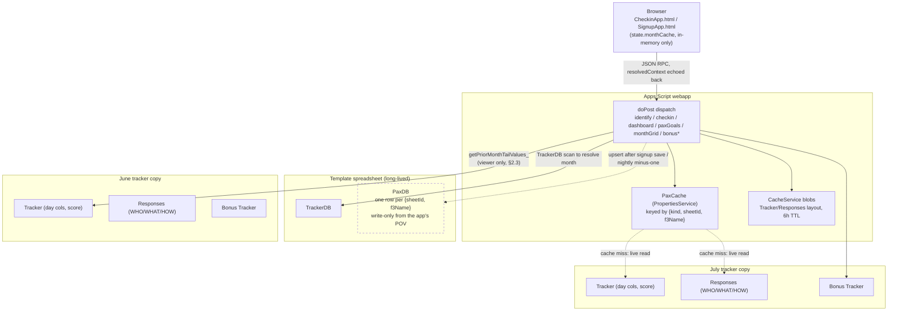
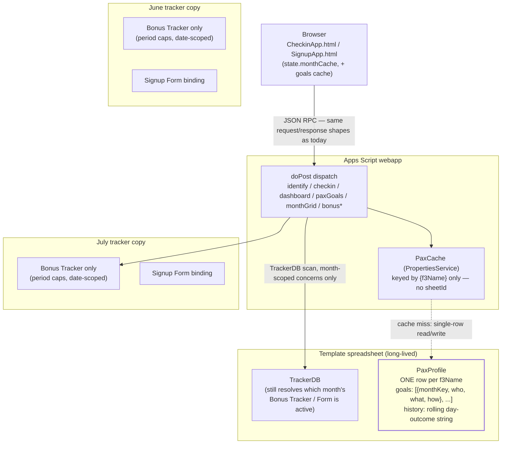

# PAX Data Model & Browser/Server Contract

**Status:** Draft — documents the current (as-built) contract and data flow, and a proposed
future data model. Nothing in the "Proposed" sections is decided or implemented; this is a
discussion document, not an ADR. If/when a direction is chosen, promote the relevant pieces into
docs/DESIGN.md and an ADR per this project's placement rules.

**Scope:** the `cmd=checkin` webapp (identify → check-in → dashboard → bonus/goals) and the
`cmd=signup` webapp (registration + goal capture), covering:
1. The wire contract between browser and server, action by action.
2. Where each piece of data physically lives today (Sheets) and how it's cached (server + client),
   with a before/after diagram (§2.6, §3.4) and a per-store data inventory — object, contents,
   written-by, read-by (§2.7, §3.5). Spreadsheet column-level detail stays in
   `docs/sheet-reference.md`; the inventory here covers the object level plus the two stores
   (`PaxCache`/`CacheService`) and browser state that sheet-reference.md doesn't.
3. A proposed PAX-centric data model, evaluated first on the current spreadsheet store, then on
   a future fast-datastore backend.
4. Suggested migration slices from the current state to the proposed one, with a recommendation
   for where to start (§5).

---

## 1. Current contract: browser ↔ server

Both webapps are Apps Script `doPost` endpoints that dispatch a JSON `{action, ...}` body to a
handler function and return JSON. There is no REST-style resource model — every action is a
named RPC.

### 1.1 `cmd=checkin` actions

| Action | Handler | Purpose |
|---|---|---|
| `identify` | `handleCheckinIdentify_` | Resolve a PAX (by typed name/email or saved session token), return their current-month state |
| `checkin` | `handleCheckinSubmit_` | Write today's/yesterday's/an explicit day's hit-miss-fail value |
| `dashboard` | `handleCheckinDashboard_` | Full team/board view: viewer's own stats + every teammate's tile |
| `paxGoals` | `handlePaxGoals_` | On-demand WHO/WHAT/HOW for one teammate (pax-detail popup) |
| `monthGrid` | `handleMonthGrid_` | Whole-month calendar for one PAX, for date-nav / the Advanced calendar |
| `bonusList` / `bonusAdd` / `bonusEdit` | `handleBonusList_` / `Add` / `Edit` | Bonus Tracker CRUD (Fellowship/Q/Inspire/EH entries) |

#### `identify` request → response

```
→ { action: 'identify', f3Name, email, token?, contextDate? }
← {
    ok: true, matched: true,
    config: { appVersion, bonusTypeRules, bonusTypeCodes, siteQName, siteQEmail, nameSpace },
    emailMismatch, f3Name, email, team, monthLabel,
    goals: { who, what, how },                // current month only, flat, no history
    todayStatus, yesterdayAvailable, yesterdayStatus,
    monthGrid: [ { dateIso, status }, ... ],   // this identify's own tracker month
    nextMonthLabel, nextMonthRegistered,
    availableMonths, registeredMonthKeys,
    firstUse,
    resolvedContext: { sheetId, monthKey, startDateIso, trackerUrl, label, rowIndex, f3Name },
    sessionGuid, ...
  }
```

`resolvedContext` is the load-bearing piece for every later request in the session: the client
echoes it back verbatim on `checkin`/`dashboard`/`paxGoals`/`monthGrid` so the server can skip
`TrackerDB` resolution and the Responses/Tracker identity re-lookup, and go straight to
`{sheetId, rowIndex}`. It is **only ever a hint** — every consumer (`resolveLeanIdentityFromHandle_`,
`resolveFullIdentityFromHandle_`) re-validates that the row at `rowIndex` still names `f3Name`
before trusting it, falling back to full resolution otherwise (a roster edit, a stale handle, or
a wrong-namespace context all degrade safely rather than binding to the wrong PAX).

#### `checkin` request → response

```
→ { action: 'checkin', f3Name, email, day: 'today'|'yesterday', value: 1|0|null|-1,
    explicitDate?, resolvedContext? }
← { ok: true }  |  { ok: false, error: 'not_found'|'day_column_not_found'|'cell_is_formula'|'invalid_value' }
```

Writes one cell in that PAX's Tracker row for that day's column. `-1` (Failed) is only accepted
for a strictly-past date — a defense-in-depth check mirrored from the client's own UI rule.

#### `dashboard` request → response

```
→ { action: 'dashboard', f3Name, dateISO?, resolvedContext? }
← {
    ok: true, f3Name, team, monthLabel, monthKey, trackerUrl,
    currentDay, totalDays, dayDates, viewDayIndex, viewDate,
    streak, maxStreak30,                      // VIEWER ONLY — cross-month-corrected (see §2.3)
    score, rawScore, scorePct, dayValues, daySegments, rollingAverage, priorMonthDayValues,
    done, missed, absent,
    bonusByType, bonusByTypeSeries,
    myTeam: [ paxRow, ... ],                  // same-team tiles
    paxBoard: [ { team, members: [paxRow, ...] }, ... ]  // whole-roster board, grouped by team
  }

  paxRow = { name, team, score, rawScore, streak, maxStreak30, scorePct, dayValues,
             daySegments, bonusByType, bonusByTypeSeries }
```

`streak`/`maxStreak30` inside every `paxRow` (myTeam/paxBoard) are computed from **this month's
Tracker row only** — no cross-month lookback. The top-level `streak`/`maxStreak30` (the viewer's
own) get a second pass (`getPriorMonthTailValues_` + `computeStreak_`/`computeMaxStreak_` over a
windowed prior-month tail) that the team-tile rows never receive. This is the root cause of the
"teammates' streaks look month-truncated" behavior investigated earlier in this thread — see §2.3.

#### `paxGoals` request → response

```
→ { action: 'paxGoals', f3Name, dateISO?, resolvedContext? }
← { ok: true, f3Name, goals: { who, what, how } }   // always "current", no month/date resolution
```

#### `monthGrid` request → response

```
→ { action: 'monthGrid', f3Name, monthKey? | date?, contextDate? }
← { ok: true, monthKey, monthLabel, monthGrid: [ {dateIso, status}, ... ], registered, trackerUrl }
```

Each call to `monthGrid` for a month other than the one `identify` already returned opens that
month's own spreadsheet independently — there is no roster-spanning "give me PAX X across every
month" request anywhere in the contract today.

#### `bonusList` / `bonusAdd` / `bonusEdit`

```
→ bonusList: { action:'bonusList', f3Name, email, dateISO? }
← { ok: true, entries: [...], bonusTypes: [...] }

→ bonusAdd:  { action:'bonusAdd', f3Name, email, type, whenIso, what, link? }
← { ok: true, ... } | { ok: false, error }

→ bonusEdit: { action:'bonusEdit', f3Name, email, rowIndex, original, originalWhenIso, whenIso, type, what, link? }
← { ok: true } | { ok: false, error: 'not_found' }
```

`bonusEdit` relocates by matching `original` (a snapshot of the pre-edit row, as last seen in a
`bonusList` response) against live sheet content, not by trusting `rowIndex` alone — a human
resorting the Bonus Tracker sheet between list and edit can't cause a wrong-row write.

### 1.2 `cmd=signup` actions (relevant subset)

```
→ handleSignupIdentify_: { f3Name, email } → prefill state, including current goals
→ handleSignupSave_:     { f3Name, email, team, teamType, who, what, how, phone, nag, ... }
← { ok: true, savedMonth, trackerUrl, checkinUrl?, identityToken? }
```

`who`/`what`/`how` are plain strings on every save — new registration or "Update my
registration" for an existing one. The server **overwrites** the one Responses-row cell for the
month being saved; there is no timestamp, no version, and no server-side record of what the
value was before the overwrite.

---

## 2. Current data flow & caching

### 2.1 Storage today

Everything lives in Google Sheets. Two spreadsheet lifetimes:

- **Template** (long-lived, one per environment): `TrackerDB` (registry of every monthly
  tracker + cross-tracker aggregates), `PaxDB` (a *separate*, periodically-rebuilt aggregate:
  one row per `{sheetId, f3Name}` holding WHO/WHAT/HOW + Hit/Miss/NoCheckin/bonus-type counts —
  see §2.4), `NamespaceDB`, `CheckinSessions`.
- **Monthly tracker copy** (one Drive file per calendar month, made from the Template):
  `Tracker` (one row per PAX: name, team, score, raw score, one column per day, one column per
  bonus period), `Responses` (signup form data, including WHO/WHAT/HOW for that month), `Bonus
  Tracker` (Fellowship/Q/Inspire/EH entries, date-scoped).

A PAX's day values, score, and goals for month M live **only** in month M's own spreadsheet.
There is no per-PAX record that spans months except `PaxDB`, and the live webapp never reads
`PaxDB` — it's write-only from the app's perspective (upserted after signup saves and after the
nightly minus-one job), consumed only by reporting/admin tooling.

### 2.2 Server-side caching

Two independent layers, both Apps Script built-ins, neither a "fast" external datastore:

- **`PaxCache` (`PaxCache.js`)** — backed by `PropertiesService` (no TTL; `CacheService`'s
  6-hour cap is shorter than a PAX's daily check-in cadence, so a TTL cache would miss every
  day). Keyed by `{kind: 'tracker'|'responses', sheetId, f3Name}`. Two shapes per sheet: a
  roster index (normalized name → row offset) and one property per PAX's full row. Freshness
  comes from write-through on every webapp write (`refreshPaxCacheRowFromSheet_dw_`) plus
  `TrackerEditTrigger.js`'s `onEdit`-driven invalidation for manual sheet edits (a monthly
  tracker copy has its own independent script + `PropertiesService` store, so `onEdit` has to be
  installed from the Template's project to reach the shared store at all).
- **Whole-sheet `CacheService` blobs** — Tracker/Responses *layout* (day/bonus column
  classification, 6-hour TTL) and Responses data rows. Separate from PaxCache; carries no
  per-PAX day values.

Because both are keyed by `sheetId` (i.e. by month), every cross-month read is a cache miss into
a *different* namespace: `getPriorMonthTailValues_` explicitly re-opens the prior month's own
`PaxCache` entry (`kind:'tracker', sheetId: priorMonth.sheetId, f3Name`) to stitch a trailing
window across the boundary. This pattern would need to be repeated for every historical month a
future feature wants to reach — it doesn't generalize past "one month back."

### 2.3 Why teammates' tile streaks look month-truncated (recap)

`buildDashboardPaxRow_` computes `streak`/`maxStreak30` from `dayValues` sourced from
`identity.trackerValues` — this month's Tracker roster only — for **every** row, viewer
included. Only afterward, for the one matched viewer, does `handleCheckinDashboard_` fetch
`getPriorMonthTailValues_` and recompute `userStreak`/`userMaxStreak30`, overwriting just the
top-level fields. `myTeam`/`paxBoard` (built from `allPaxRows` earlier in the same function)
never receive that correction. Early in a calendar month, every teammate but the viewer shows an
artificially short streak. (Analyzed, not yet fixed — tracked separately.)

### 2.4 PaxDB: the aggregate that already exists but isn't read live

`PaxDB` (go30tools.js) is a Template-resident sheet, one row per `{SheetId, F3 Name}`, columns:
`SheetId, Date, F3 Name, Team, WHO, WHAT, HOW, Comments, Hit, Miss, NoCheckin, Fellowship, Q
Point, Inspire, EHing FNG, Email, Team Type, Other Team, Phone, NAG Email`. It's upserted
incrementally (`upsertPaxDbRow_`, keyed by `{SheetId, F3 Name}`, O(n) linear scan of existing
rows per write — a lock-guarded full-column read, not a cache) after signup saves and after the
nightly minus-one job, and can be fully rebuilt by `scanTrackers()`/a historical rebuild. It is
the closest thing this system already has to a cross-tracker PAX aggregate — but it's still one
row **per month**, not one row per PAX, so it doesn't yet answer "give me PAX X's full history"
without scanning every row that matches their name across however many months exist. The live
webapp (`dashboardWebapp.js`) never reads it at all; it's a write-only side channel for
reporting.

### 2.5 Client-side caching

No `localStorage`/`sessionStorage` involvement for PAX data at all — `localStorage` is used
**only** for the identity token (`{f3Name, email}`, `IdentityCore.html`) so a returning visitor
doesn't have to retype who they are; it holds nothing about scores, streaks, or goals.

All PAX-data caching client-side is an in-memory JS object, `state.monthCache`, scoped to the
current page load:

- Populated by `prefetchDashboard_` at identify time, keyed by `monthKey`.
- Write-through patched (`patchOwnDayIntoPayload_`) on the viewer's own check-in submit, so the
  cached payload's `dayValues`/matching `myTeam`/`paxBoard` entries reflect the just-written
  value without a refetch.
- Explicitly invalidated (`invalidateMonthCacheFor_`) for the touched month only, on a
  successful checkin write, so "Continue to Dashboard" re-fetches live data instead of the
  pre-checkin snapshot.
- **`paxGoals` has no client-side cache at all** — every tap of a team tile re-fetches goals from
  the server, even for the same PAX opened twice in one session.

### 2.6 Before: current state diagram



Two structural problems this diagram makes visible: (1) `PaxCache` is keyed by `sheetId`, so
reaching one month back for the viewer's streak means a second cache namespace
(`getPriorMonthTailValues_`) — a lookup that isn't applied to teammates at all; (2) `PaxDB`
already sits centrally in the Template with per-PAX goal/stat data, but nothing in the live
read path (`Dispatch`) ever queries it — it's a write-only side channel.

### 2.7 Data inventory: objects, contents, and who touches them (current state)

Full spreadsheet column-by-column schema lives in `docs/sheet-reference.md` — this table stays
at the object level and adds the two stores (`PaxCache`, `CacheService`) and the browser state
that sheet-reference.md doesn't cover, so every box in the §2.6 diagram maps to something
concrete.

**Spreadsheet (Template-resident)**

| Object | Contents | Written by | Read by |
|---|---|---|---|
| `TrackerDB` | One row per monthly tracker: `SheetId`, `StartDate`, URLs, aggregate stats | `CreateNewTracker.js` (new month), `scanTrackers()` (rescan) | `resolveDashboardMonth_`/`resolveTrackerDbRowForContextDate_` on every action that needs to pick a month |
| `PaxDB` | One row per `{SheetId, F3 Name}`: goals + Hit/Miss/NoCheckin/bonus counts (full column list in §2.4) | `upsertPaxDbRow_` (after signup save, after nightly minus-one), `scanTrackers()`/historical rebuild | Reporting/admin tooling only — **never** the live `cmd=checkin`/`cmd=signup` webapp |
| `NamespaceDB` | Registry of provisioned namespace environments (ADR-014) | `copyTemplate` admin action | `resolveTemplateSpreadsheet_` (ns resolution on every request) |
| `CheckinSessions` | One row per saved-link session guid: `f3Name`, `email`, created/last-used timestamps | `createOrTouchCheckinSession_dw_` (every `identify`) | `resolveCheckinToken_dw_`/`resolveCheckinSession_dw_` (token-based `identify`) |

**Spreadsheet (per monthly tracker copy)**

| Object | Contents | Written by | Read by |
|---|---|---|---|
| `Tracker` | One row per PAX: name, team, raw/derived score, one column per day, one column per bonus period | `handleCheckinSubmit_` (day cell), Bonus Tracker formulas (score columns), `CreateNewTracker.js` (row creation via form submit) | `handleCheckinDashboard_`, `handleCheckinIdentify_`, `handleMonthGrid_` — every action that reports score/streak/day status |
| `Responses` | One row per PAX signup for that month: WHO/WHAT/HOW, email, team, participation status | `handleSignupSave_`/form submit | `resolveCheckinIdentityLean_`/`Full_` (identity match + goals), `handlePaxGoals_` |
| `Bonus Tracker` | One row per bonus entry: PAX name, type, date, what/link | `handleBonusAdd_`/`handleBonusEdit_` | `handleBonusList_`, `computeBonusSeriesForPax_dw_` (dashboard bonus pills) |

**PropertiesService (`PaxCache.js`)**

| Object | Contents | Written by | Read by |
|---|---|---|---|
| Roster index — `go30idx:{kind}:{sheetId}` | JSON map: normalized name → row offset | `setPaxCacheRowsBulk_dw_` (bulk repopulate on cold roster read) | `buildTrackerValuesFromPaxCache_`, `resolvePaxRowIndex_dw_` |
| Per-PAX row — `go30pax:{kind}:{sheetId}:{f3Name}` | This PAX's full Tracker or Responses row, as last read/written | `setPaxCacheRow_dw_`/`refreshPaxCacheRowFromSheet_dw_` on every checkin/bonus write | Every identity resolver (`resolveCheckinIdentityLean_/Full_`, `resolveLeanIdentityFromHandle_`, `getPriorMonthTailValues_`) |

**CacheService**

| Object | Contents | Written by | Read by |
|---|---|---|---|
| Tracker/Responses layout blob (6h TTL) | Row2/row3 header classification (which columns are days vs. bonus) | `getTrackerLayout_`/`getResponsesLayout_` on a cold read | `classifyTrackerColumns_` callers — every action that needs to map a date to a column |
| Responses full-sheet values blob | Whole Responses data-row range, whole-sheet granularity | `setCachedSheetValues_` on `resolveCheckinIdentityFull_`'s cold read | `resolveCheckinIdentityFull_` (dashboard's full-roster identity) |

**Browser (in-memory JS only — no `localStorage`/`sessionStorage` for PAX data)**

| Object | Contents | Written by | Read by |
|---|---|---|---|
| `state.monthCache[monthKey]` | The full `dashboard` response payload for a visited month | `prefetchDashboard_` (populate), `patchOwnDayIntoPayload_` (write-through on own checkin) | `renderDashboard_`, date-nav arrows (cache-hit fast path) |
| `localStorage[IDENTITY_STORAGE_KEY]` | `{f3Name, email}` only — identity prefill, nothing about scores/streaks/goals | `IdentityCore.html` on successful identify | Return-visit prefill on both `CheckinApp.html`/`SignupApp.html` |
| (none) | Teammate goals (`paxGoals` response) | — | Fetched fresh from the server on every pax-detail popup open, never cached |

---

## 3. Proposed data model

### 3.1 Shape: one record per PAX, not one row per PAX-per-month

```
PaxProfile {
  f3Name,                      // key
  team, email, phone,
  goals: [
    { monthKey: "2026-06", who, what, how },
    { monthKey: "2026-07", who, what, how }
  ],
  historyEndDate: "2026-08-02",  // ISO date the LAST character of `history` represents
  history: "1101.0-1..."         // one char/day, dense-encoded, rolling ~400-day window,
                                  // history[0] = historyEndDate - (history.length - 1) days
}
```

- **Goals become a small, upsert-by-`monthKey` list**, not a single overwritten value.
  `effectiveAt` is pinned to the 1st of the month a save targets (decided in this thread): a
  re-save within the same month upserts that month's entry (matching today's real
  last-write-wins-within-a-month behavior); a save in a new month appends a new entry. Current
  goals = the entry for the current `monthKey`. Point-in-time reporting = the entry for whatever
  `monthKey` is asked for — a lookup in one small list, not a re-derivation from a month's own
  spreadsheet (which today can't even answer this, since an overwrite destroys the prior value).
- **History becomes a single rolling-window string, anchored by an explicit `historyEndDate`.**
  A bare string of day-outcome characters is ambiguous on its own — without a stamped date, there
  is no way to know which calendar day any character represents, especially since the window
  shifts by one day on every write. `historyEndDate` is the record's own statement of "this is
  the most recent day represented" (the character at index 0 is the oldest, one day at a time,
  counting back from `historyEndDate`). Every write (a new day's checkin) advances
  `historyEndDate` and shifts the string in the same operation — the two fields are updated
  together, never independently, so the anchor can never drift out of sync with its data.
  Streak/30-day-best/score are all slices/scans of one field, anchored against `historyEndDate`
  rather than "whatever month happens to be current." This removes the entire "prior month tail"
  cross-namespace-cache-miss pattern (§2.2): there's no other month's cache entry left to reach
  into, because a PAX's timeline is one self-describing record.
- Bounding history to a fixed window (e.g. ~400 days) keeps the record well under any of Sheets'
  cell limit (50k chars) or `PropertiesService`'s per-value limit (9KB) — a dense 1-char/day
  encoding of 400 days is ~400 bytes, comfortably inside either.

### 3.2 On the current store (Sheets), before any datastore migration

- `PaxProfile` becomes what `PaxDB` almost already is, restructured: **one row per PAX** (not
  per PAX-per-month) in the Template, with `goals` and `history` stored as JSON-ish string
  columns instead of one-row-per-month + separate Tracker-sheet day columns.
- `PaxCache` gets re-keyed by `f3Name` alone (dropping `sheetId` from the key entirely) — the
  same `PropertiesService` write-through mechanism already in place today, just with one
  namespace collapse. `getPriorMonthTailValues_` and the viewer-only streak-correction
  special-case (§2.3) both disappear, because there's nothing cross-month left to stitch.
  Team-board reads still batch via a roster index → bulk `getProperties()`, unchanged in
  mechanism.
- Writes (`checkin`, bonus, goal save) become single-row upserts against this one PaxProfile
  sheet instead of a cell write into whichever month's Tracker/Responses sheet is currently
  active — closer to how `upsertPaxDbRow_` already works today, just as the primary write path
  instead of a side-effect aggregate.
- **Contract impact: none, for the live apps.** As established earlier in this thread, every
  existing request/response shape (`identify`, `checkin`, `dashboard`, `paxGoals`) stays
  byte-for-byte the same from the client's point of view — only the server's internal resolution
  changes from "read/write a cell in month M's spreadsheet" to "read/write a field in this PAX's
  one record." The one addition is an optional `monthKey` param on `paxGoals` for point-in-time
  reporting, additive and back-compatible per this repo's own installed-client compatibility
  rule.
- Monthly tracker copies likely still need to exist for anything that's genuinely
  month-scoped-by-nature (the Bonus Tracker's period caps, the signup Form binding, admin
  per-month spreadsheet access for Site Qs) — this proposal consolidates the PAX-identity/
  history/goals data, not necessarily the whole monthly-copy mechanism. That's a separate
  scoping question outside what's been evaluated here.

### 3.3 On a future fast datastore

If/when a real datastore (Firestore-style document store, or a KV store) is available, the same
`PaxProfile` shape drops in unchanged as a document, keyed by `f3Name`:

- `get(f3Name)` / `upsert(f3Name, fields)` replace `getPaxCacheRow_dw_`/`setPaxCacheRow_dw_` —
  same access pattern, different transport. No calling code above the cache-abstraction layer
  needs to change shape, only which library backs `PaxCache.js`'s two functions.
- The rolling-window history string could become a real time-series (one doc per day, or a
  proper array field) once cell-size/row-count constraints no longer apply — but doesn't have to
  on day one; the dense string is forward-compatible (a migration script unpacks it once).
- Team-board reads (`myTeam`/`paxBoard`, currently a `PropertiesService` bulk `getProperties()`
  keyed off a roster index) become a native `WHERE team = X` / batched-get query — the roster
  index concept can retire once the store itself supports querying by field, rather than needing
  a hand-rolled name→row index.
- The contract (§1) still doesn't need to change for this migration — it was already designed
  around "the server resolves whatever it needs and returns the same shape," so swapping what's
  behind `PaxCache.js` is invisible to `CheckinApp.html`/`SignupApp.html` either way. The
  migration risk lives entirely in the write paths' consistency guarantees (Sheets' single-writer
  lock semantics vs. a datastore's own transaction model), not in the client contract.

### 3.4 After: proposed state diagram



Same contract, same actions — the only thing that moved is what's *behind* `Dispatch`. Reading
or writing a PAX's goals/history is a single-record operation with no month-namespace to cross,
so `getPriorMonthTailValues_` and the viewer-only correction (§2.3) simply don't exist in this
picture. Monthly tracker copies persist only for what's genuinely month-scoped (Bonus Tracker
period caps, the signup Form binding) — see the open item in §6.

### 3.5 Data inventory: objects, contents, and who touches them (proposed state)

Same table shape as §2.7, so each row can be diffed directly against its current-state
counterpart.

**Spreadsheet (Template-resident)**

| Object | Contents | Written by | Read by |
|---|---|---|---|
| `TrackerDB` | Unchanged — still resolves which month's Bonus Tracker/Form is active | Unchanged | Unchanged, but narrower scope: only bonus/form dispatch, no longer score/streak/goal resolution |
| `PaxProfile` (replaces `PaxDB`) | **One row per `f3Name`**: team/email/phone, `goals: [{monthKey, who, what, how}]`, `history` rolling day-outcome string | `handleCheckinSubmit_` (history), `handleSignupSave_` (goals upsert by `monthKey`) — both live-request writers now, not a side-effect aggregate | `handleCheckinDashboard_`, `handleCheckinIdentify_`, `handlePaxGoals_`, `handleMonthGrid_` — the live webapp reads it directly for the first time |
| `NamespaceDB`, `CheckinSessions` | Unchanged | Unchanged | Unchanged |

**Spreadsheet (per monthly tracker copy) — narrowed scope**

| Object | Contents | Written by | Read by |
|---|---|---|---|
| `Bonus Tracker` | Unchanged — still date-scoped, period-capped entries | `handleBonusAdd_`/`handleBonusEdit_` | `handleBonusList_` |
| Signup Form binding | Unchanged — still needed to receive new signups into that month | Google Forms | `CreateNewTracker.js` (row provisioning) |
| ~~`Tracker` day columns~~ | Retired as the source of truth for day values/score/streak — superseded by `PaxProfile.history` | — | — |
| ~~`Responses` WHO/WHAT/HOW~~ | Retired as the source of truth for goals — superseded by `PaxProfile.goals` (Responses may still receive the raw form write, per §3.2, until the record is trusted) | — | — |

**PropertiesService (`PaxCache.js`) — re-keyed**

| Object | Contents | Written by | Read by |
|---|---|---|---|
| Roster index — `go30idx:{f3Name-namespace}` | Normalized name → PaxProfile row offset (no `sheetId` dimension) | Bulk repopulate on cold roster read | Team-board reads (`myTeam`/`paxBoard`) |
| Per-PAX record — `go30pax:{f3Name}` | The whole `PaxProfile` shape: goals list + history string | Write-through on every checkin/bonus/goal-save write | Every identity/dashboard/goals resolver — one lookup, no cross-month stitching |

**CacheService** — unchanged in mechanism (Bonus Tracker layout classification still applies to the narrowed per-month sheet); no longer caches Tracker/Responses layout for score/streak/goal purposes since those columns are retired.

**Browser** — unchanged shape from §2.7, plus one addition: a small in-memory `state.goalsCache[f3Name]` becomes viable once `paxGoals` is cheap (one `PaxProfile` field already loaded alongside score/streak, per §3.2's contract-impact note), closing the "goals never cached client-side" gap noted in §2.7's last row.

---

## 5. Suggested migration slices

Getting from §2's "before" to §3's "after" doesn't have to be one migration. Each slice below is
independently shippable, leaves the contract (§1) unchanged for the live apps at every step, and
narrows the gap without requiring the ones after it.

### Slice 1 — f3Name-keyed rolling history window (streak/maxStreak30 only)

The smallest real piece of `PaxProfile.history`: a new `PaxCache` kind keyed by `f3Name` alone,
holding `{ historyEndDate, days }` — ~40 days of dense day-outcome encoding (enough padding for
`MAX_STREAK_WINDOW_DAYS_`), anchored by `historyEndDate` exactly per §3.1 (the two fields always
move together: a new day's write advances `historyEndDate` by one and shifts `days` in the same
operation, so the anchor can never drift out of sync with what it describes). Write-through on
`handleCheckinSubmit_` and the nightly minus-one job; read by `buildDashboardPaxRow_` for
**every** row (viewer and teammates alike) instead of `computeStreak_(dayValues)` off the current
month's Tracker columns. Cold-start for a PAX with no window yet falls back once to today's
`getPriorMonthTailValues_` logic, then persists the result under the new key with
`historyEndDate` set to that read's own "as of" day. `getPriorMonthTailValues_` and the
viewer-only override (dashboardWebapp.js:2247-2260) delete entirely once this lands.

*Fixes the streak-month-boundary bug for every teammate, not just the viewer — directly answers
the question this thread started from.*

**Read side, as shipped (F3Go30-uz9e.2).** §3.1's anchor rule binds on read as well as write, and
Slice 1's first cut only honoured it on write. Two rules the read path enforces:

1. **Anchored to the caller's context date, not to "now".** `getPaxHistoryWindowValues_` takes the
   day the window must END on — the last reported day column
   (`dayDates[dayDates.length - 1]`), which is today for the current month and that month's last
   day under backward date navigation. A stored window ending *after* that day (the PAX pre-marked
   a future day) is trimmed; one ending *before* it (nothing written for a few days) is padded at
   the tail with `.`, which is safe only at the tail because `computeStreak_` trims trailing blanks
   before counting. A window that cannot reach the anchor at all is treated as a miss.
2. **Reconciled against the Tracker row.** The window and the tracker-kind `PaxCache` row are two
   representations of the same day values, written by two independent write-through calls with
   nothing checking they agree; the Tracker row is already in hand, so the overlapping tail is
   compared against it and the window is rebuilt from the sheet on any disagreement. This is what
   makes a wrong entry self-heal — the cold-start path only ever fired on a *missing* entry.

Write side: a checkin for a **future** day (advance check-in is intended and unrestricted for
`1`/`0`/`null`) is not folded into the window at all. Advancing it would pad every skipped day
with `.` and shift that many days of real history off the front permanently. The value lives on
the Tracker, and rule 2 brings it into the window on the first read once the day is in range.

### Slice 2 — versioned goals list on the same f3Name-keyed record

Extend the Slice 1 record (or add a sibling `PaxCache` entry under the same `f3Name` key) with the
`goals: [{monthKey, who, what, how}]` list from §3.1. `handleSignupSave_` upserts by `monthKey`
(pinned to the 1st of the month) instead of overwriting the month's Responses cell directly —
Responses can still be written too, for anyone not yet ready to trust the new record as the
source of truth. `paxGoals` gains the optional `monthKey` param (additive, back-compatible) and
starts reading from this record instead of `resolveCheckinIdentityLean_`'s Responses-row fetch.

*Unlocks point-in-time goal reporting — the second concrete need raised in this thread — without
touching the Tracker/day-value side of the model at all.*

### Slice 3 — PaxProfile becomes the primary store, `PaxDB` retires

Consolidate Slices 1+2 plus score/raw-score into one real `PaxProfile` sheet (one row per
`f3Name`, per §3.2), sourced by migrating existing `PaxDB` rows (already per-PAX-per-month, just
needs folding into one row per name) and backfilling `history` from every live Tracker sheet.
`checkin`/`bonus` writes move to single-row upserts against this sheet. `PaxDB`'s incremental
upsert (`upsertPaxDbRow_`) and the nightly/`scanTrackers()` rebuild retire — nothing left for them
to feed that isn't already current.

*This is the slice that actually changes the primary write path — do it only after Slices 1-2
have proven the record shape and cache re-keying hold up under real traffic.*

### Slice 4 — swap the backing store

Once a fast external datastore is available, replace what's behind `PaxCache.js`'s `get`/`upsert`
functions (per §3.3) — no slice above needs to be redone; they were already designed around a
single-key document, so this is a transport swap, not a reshape.

### Recommendation: start with Slice 1

Slice 1 is the right next step: it's the smallest diff (one new cache kind, two write-through call
sites, one read-path change), it's purely additive (nothing existing is removed except the
now-redundant viewer-only special case), and it directly fixes the bug this whole investigation
started from. It also happens to be the first real piece of `PaxProfile.history`, so nothing
about it needs to be thrown away when Slice 3 consolidates everything into the full record —
Slice 2 and 3 build on top of it rather than around it.

---

## 6. Open items (not resolved by this document)

- Whether monthly tracker-copy spreadsheets stay as the mechanism for Bonus Tracker
  period-capping and signup Form binding, or also get consolidated — out of scope here.
- Whether `effectiveAt`-pinned-to-month-start goals should eventually become truly mid-month
  effective-dated, changing the UX around "Update my registration" — flagged earlier, deferred.
- Migration path/sequencing for converting existing `PaxDB` (one row per PAX-per-month) and every
  live Tracker sheet's history into the new one-row-per-PAX shape — detailed at a slice level in
  §5, but the exact backfill mechanics (batch size, verification, rollback) aren't designed here.
