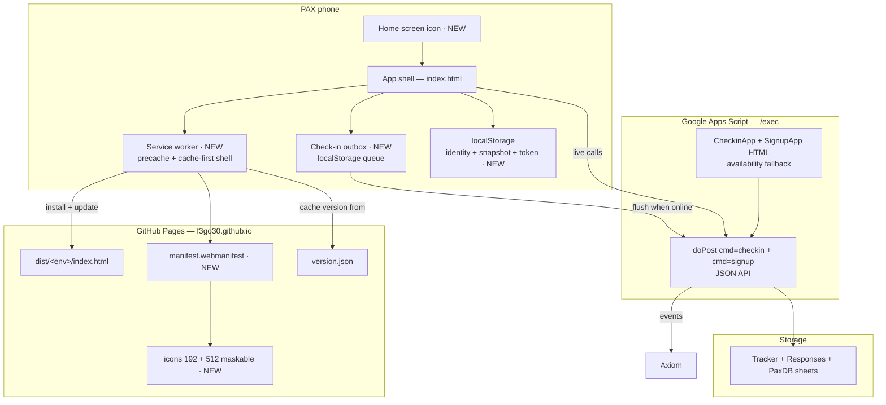
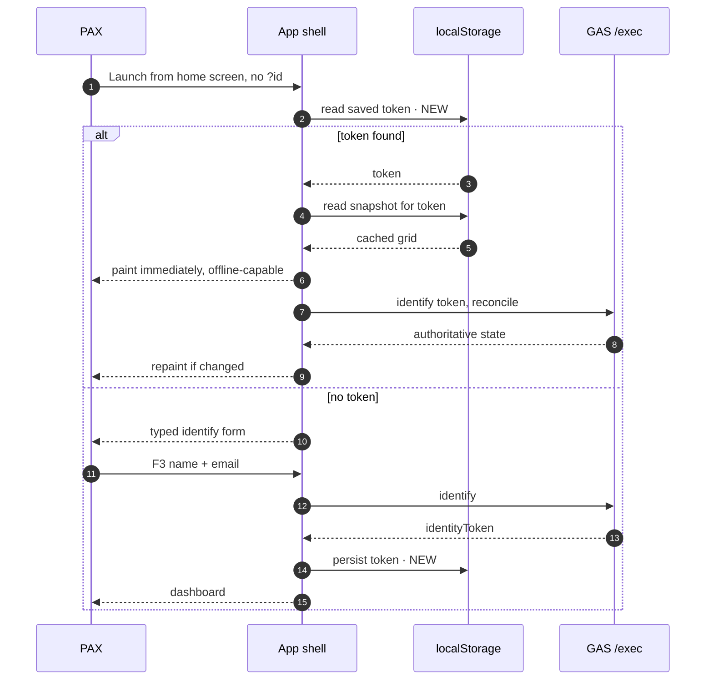
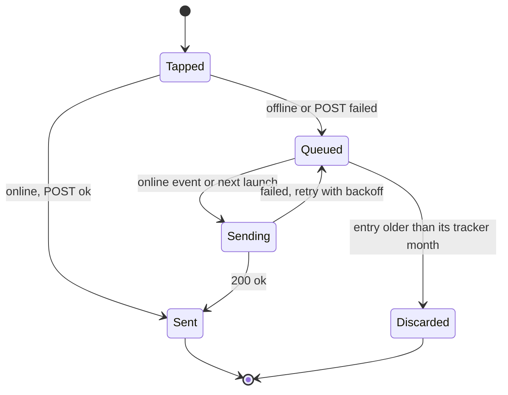
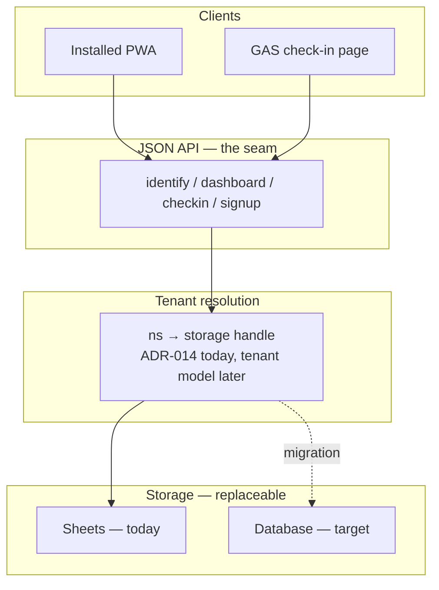

# Design: Installable Check-In App (PWA)

> Status: **Draft — under iteration.** Nothing here is committed to. Scope, phasing, and the
> long-term storage direction (§11) are open for revision. Follows the precedent of
> `docs/signup-webapp-requirements.md`: a feature-scoped design doc that carries the rationale,
> with the eventual contract living in code. Decisions that harden go to `/adr/` —
> §7 is now **ADR-018**.
>
> Tracked as epic **F3Go30-833s**. Diagram intent is stated per `validate-diagram-intent`;
> no diagram uses explicit styling, so all four render in the viewer's own light/dark theme.

---

## 1. Problem

The product's failure mode is not latency — it is a PAX forgetting to check in. That shows up
directly in the tracker data as `NoCheckin` days: for July 2026, PaxDB records PAX with 6+
no-check-in days inside a 17-day window, against goals they were otherwise hitting.

The current re-entry affordances are a nag email and a saved bookmark. Neither sits on the home
screen next to the apps a PAX opens without thinking. An installed icon is the only intervention
in this design that plausibly moves the metric the app exists to move.

Two secondary problems ride along:

- **Signal.** Check-in happens at 0530 in a parking lot. A failed POST today is a lost check-in.
- **Storage eviction.** Safari's ITP clears script-writable storage after 7 days without
  interaction for non-installed sites. Installed home-screen apps are exempt. The PAX most
  likely to be evicted is the lapsed one — exactly who the nag email is trying to recover.

## 2. Constraints

| Constraint | Consequence |
|---|---|
| GAS `HtmlService` serves inside a sandboxed iframe on `*.googleusercontent.com` | The GAS front end can never be a PWA. No manifest, no service-worker scope, no headers. See `script/dashboardWebapp.js:432`. |
| iOS has no install prompt | Installation is a manual, per-PAX, Q-assisted act. Every benefit below is gated on it. |
| Backend telemetry only | Axiom sees server-side events. A shell that breaks before it fetches is invisible. |
| Volunteer maintenance, mid-month deploys | Any client-side cache must be invalidated by the existing deploy pipeline, not by hand. |
| ~21–32 PAX per month | Effort must stay proportionate. This is not a scale problem. |

## 3. Non-goals

- Making the GAS pages installable. `CheckinApp.html` and `SignupApp.html` both stay as the
  availability fallback; retiring either is decided in `F3Go30-90l5` (posture: scheduled for
  removal) and executed in `F3Go30-wjpu`. See §7.
- Offline **bonus** edits. The cross-month row-relocation path has a known stale-`rowIndex` bug
  class (`F3Go30-4j4o.2`) and is not safe to queue. Offline scope is day-cell check-ins only.
- Web push in Phase 1 or 2. See §8 phasing and §10.4.
- Any change to the GAS API contract. The PWA is a client-side change.

---

## 4. Architecture

> **Question:** Which components must be added to make the static check-in page installable?
> **Audience:** F3Go30 maintainer.
> Components marked `· NEW` do not exist today. Everything else ships already.

The service worker owns **shell delivery only**. API calls stay network-only and unproxied — the
outbox, not the worker, is what makes a check-in survive a dead network. This keeps the worker
small enough to reason about and keeps a stale worker from serving stale *data*.

## 5. The identity gap — the blocking prerequisite

> **Question:** How does an installed launch resolve identity when the URL carries no `?id` token?
> **Audience:** F3Go30 maintainer.

The check-in token today lives **only in the URL**. `STATIC_TOKEN_` reads `?id`
(`static-pages/src/index.html:516`) and `applyIdentifySuccess_` writes it back via
`history.replaceState` (`:827`). `localStorage` holds `f3Name`/`email` and a snapshot *keyed by*
the token — never the token itself.

An installed icon launches `start_url` = `./`, token-less, every time. Without a fix, the
installed app demands a typed re-identify on every cold start — strictly worse than the bookmark
it replaces. **This is the one change that must land before any manifest ships.**

The snapshot-first paint already exists (`CHECKIN_SNAPSHOT_KEY_`, 14-day TTL). Persisting the
token is what lets it be reached on a cold launch. `clearCheckinSnapshot_` and the sign-out path
must clear it too.

### 5.1 Storage keys must be namespaced per environment

SIT and PROD are different *paths* on the **same origin** —
`https://f3go30.github.io/static-pages/dist/{sit,prod}/`. Different paths mean different manifest
scopes, so they install as two independent apps; but `localStorage` is keyed by **origin, not
path**, so those two installs share one storage bucket.

Today's keys are not env-namespaced: `IDENTITY_STORAGE_KEY = 'go30SignupIdentity'` (`:532`) and
`CHECKIN_SNAPSHOT_KEY_ = 'go30CheckinSnapshot:v1'` (`:554`). The snapshot happens to be
self-protecting — `loadCheckinSnapshot_` rejects a snapshot whose `token` doesn't match the token
in hand — and a shared name/email is harmless. **A shared token is not.** A stored SIT token
would be picked up by the PROD install on cold launch, fail identify against a different
`CheckinSessions` sheet, and dead-end a PAX with no obvious recovery.

So §5's stored token must be keyed per deployment — by env, or by a hash of `WEBAPP_URL`, which
is already baked per-env by `build-static-pages.js`. The same applies to Cache Storage names in
Phase 2: origin-keyed, so the cache name needs env *and* version, not version alone.

## 6. Offline durability

> **Question:** When does a check-in tapped with no network become durable?
> **Audience:** F3Go30 maintainer.

Day-cell check-ins are idempotent — the server sets a cell to `1`/`0` — so replay is safe and
ordering does not matter. That property is what makes an outbox tractable here and is the reason
bonus edits are excluded.

Rules:

- The optimistic UI paints the tap immediately and marks it pending until acknowledged.
- Flush on `online` and on launch. Background Sync is Chrome-only; skip it — it buys little for
  the ~95% case and adds a second code path.
- Entries carry their target `dateIso`, so a queued check-in that flushes after midnight still
  lands on the right day. Entries whose month has closed are discarded, not replayed.

## 7. Consolidating signup into the static page

**Decided.** Signup moves into the static page over the existing `cmd=signup` JSON API. This
resolves the A/B choice in §10.3 in favour of the proper fix rather than the standalone-only
stopgap.

**It requires no server work.** `handleSignupPost_` (`script/WebApp.js:128`) already dispatches
`identify`, `save`, and `feedback` as JSON actions, and `handleSignupIdentify_` already returns
`months`, `aoList`, and `goalList` on both the matched and unmatched paths
(`script/signupWebapp.js:542`) — which is everything `SignupApp.html` receives as server-injected
template variables at render time. The API this needs already exists and is already in use.

**Signup becomes a step in `index.html`, not a second static page.** A separate `signup.html`
would be same-origin and in-scope, so it would open inside the standalone window with no back
button on iOS (§10.3 item 4), and it would need the identity handed off to it. As a step in the
page the check-in app already owns, there is no navigation and no handoff at all — the identity
is already in memory. That is what removes all three ejection paths rather than relocating them.

The one server-injected value with no JSON equivalent is `urlIdentityJson` (`WebApp.js:49`), which
exists purely to carry identity across the redirect from check-in to signup. In-page, that
handoff has nothing to carry: the problem is deleted rather than ported.

**The GAS `SignupApp.html` stays as the availability fallback**, exactly as `CheckinApp.html`
does. Both front ends keep sharing the same JSON handlers, so this adds no divergence — it moves
the *primary* signup path onto the static origin.

It is **not** an install-free path. The static page already is that: an ordinary web page on
GitHub Pages, where installing only adds a home-screen icon. What the GAS page still provides is
narrower — a second origin if the static host is unreachable, and the legacy-link route for
already-distributed `?cmd=signup` URLs, which `F3Go30-833s.11` resolves into a query-preserving
redirect (the route, not the rendered page).

Retiring it is no longer undecided: `F3Go30-90l5` set the posture to scheduled-for-removal,
gated on `F3Go30-833s.11` complete plus a month of real static-signup use in PROD. Execution is
`F3Go30-wjpu`.

**`?cmd=signup` stays a URL contract, not a GAS address.** The static page already honours a
param contract that mirrors GAS's — `buildStaticCheckinUrl_` (`Utilities.js:418`) documents it as
"query params mirror what `static-pages/src/index.html` reads (`STATIC_PARAMS_`): webapp, id, ns,
contextDate". The static page simply never implemented the signup half, having no signup UI to
route to. It should: `?cmd=signup` on the static URL opens the page directly on the signup step,
alongside `targetMonth` and `autoStart`.

That makes both origins honour one URL vocabulary, and it collapses the migration problem
(`F3Go30-833s.11`) into a **base-URL swap with the query string preserved** — precisely what
`buildStaticCheckinUrl_` already does for check-in. `buildStaticSignupUrl_` becomes the same
builder with `cmd=signup`, and the GAS page's job for genuinely old links is a query-preserving
redirect rather than anything bespoke.

One footgun this creates: `cmd` would then carry **two meanings** in the static page. `CMD_`
(`index.html:513`) is the *API dispatcher* selector — `callApi` posts to
`WEBAPP_URL + '?cmd=' + CMD_` — while `?cmd=signup` on the page's own URL would be *page routing*.
Since `?cmd=signup` and `?cmd=checkin` reach different server dispatchers (`handleSignupPost_` vs
the check-in one), signup actions must post to `cmd=signup` and check-in actions to `cmd=checkin`
from the same page. `CMD_` therefore has to become per-call rather than a page constant; leaving
it as a constant would route signup actions into the check-in dispatcher and fail as
`unknown_action`.

**Test impact is smaller than it looks, but not zero.** The bulk of `npm test` is
front-end-neutral: `test_signup_webapp.js` and the other handler tests `require()` the
`script/*.js` modules and exercise shared JSON handler and pure-function logic, which this change
does not touch. Two things *are* GAS-bound and need static twins —
`tests/playwright/identity-token-flow.spec.js` (the signup E2E, which would otherwise end up
testing only the fallback) and the client-invariant tests that read `SignupApp.html` source.
`tests/playwright/static-checkin.spec.js` is the established precedent for a static twin.
Tracked as `F3Go30-833s.12`. Separately, no node test reads `static-pages/src/index.html` at all
today — a pre-existing gap in check-in coverage, tracked as `F3Go30-giqm`.

**This has value independent of the PWA.** It is what makes the static origin a complete front
end rather than a check-in-only surface, and it is a prerequisite for the URL-token and rotation
work (§10.2) — a signup flow that navigates to `script.google.com` and back is exactly what forces
the token to be URL-carried today.

**Decided as ADR-018.** The record carries the rationale and the rejected alternatives; this
section keeps the working detail.

Rollout beyond the UI itself splits in two. New links are an emitter change —
`buildSignupSlackMessage_` (`Utilities.js:347`), `template.signupUrl` (`WebApp.js:52`, rendered by
`HomeApp.html`), and the GAS check-in page's own signup redirects all still mint `?cmd=signup`
URLs, and each should go through a `buildStaticSignupUrl_` mirroring the existing
`buildStaticCheckinUrl_`. Links *already distributed* — TinyURL short links minted per tracker
(`ShortHC` in TrackerDB), Slack history, PAX bookmarks — cannot be rewritten, so the GAS signup
page has to carry arrivals across itself. Tracked as `F3Go30-833s.11`; the emails are
`F3Go30-833s.10`.

## 8. Phasing

Cost is concentrated in the service worker; benefit is concentrated in the icon. They separate.

| Phase | Contents | Risk |
|---|---|---|
| **1 — Installable** | Token persistence (§5), static signup (§7), manifest, icons, iOS meta, sign-out (§10.1), standalone reporting, signup-link migration | Low. No service worker, so no stale-shell failure mode. Static signup is the largest single piece and the only one that touches a live flow. |
| **GATE** | One month of adoption data, then an explicit proceed-or-stop decision | — |
| **2 — Resilient + hardening** | Service worker with version-pinned precache, offline outbox, token rotation (§10.2) | Real. Introduces a client artifact you cannot reach remotely. Rotation is gated on Q6, not on the worker. |
| **3 — Re-engagement** | Web push replacing or augmenting nag email | High cost, own ADR. Unscoped and unbeaded on purpose. |

Phase membership is carried in the tracker too: children of `F3Go30-833s` are title-prefixed
`Ph1:` / `Ph2:` / `GATE:` and labelled `phase-1` / `phase-2` / `gate`, so
`bd list --label phase-1` returns the current working set. `bd show F3Go30-833s` holds the
same map.

**Gate between 1 and 2:** ship Phase 1, then measure standalone launches in Axiom over one full
month. If PAX are not installing, Phase 2 is pure cost and the work stops there. This requires a
`display-mode: standalone` signal on the identify call — cheap, and worth adding in Phase 1 so
the gate has data to read.

## 9. Risks

| Risk | Mitigation |
|---|---|
| Nobody installs; all cost, no benefit | Phase gate at §8. Q-assisted install instructions on `how-it-works.html`. |
| Stale shell after a mid-month deploy | Cache name derived from the `version.json` stamp `build-static-pages.js` already emits. Never hand-managed. |
| A broken service worker is invisible to Axiom | Keep API calls out of the worker; report the shell version on every identify so a stale cohort is visible server-side. |
| Third front-end state — installed / browser / GAS | Extend the `activity_log.py` entry-path join to report `standalone` alongside `static page` and `GAS page`. |
| Offline queue corrupts a bonus row | Out of scope by design. Check-ins only. |
| Static signup regresses a flow every PAX uses monthly | The GAS signup page stays as the fallback, and the JSON handlers are shared and already covered by `test_signup_webapp.js`. Ship SIT-then-PROD as usual. |
| `index.html` grows past a comfortable single-file size | Already 2,013 lines; signup adds roughly 600. Revisit the single-file constraint if it passes ~3,500, not before — being dependency-free is what makes the page cheap to reason about. |

---

## 10. Security posture

**Installing grants no new privilege.** An installed PWA runs in the same web sandbox as the tab
it was installed from — same origin rules, same permission prompts, no filesystem, no ambient
authority. Nothing here expands the attack surface by virtue of being installed.

What *does* change is **credential lifetime**, and it cuts both ways.

### 10.1 The change to guard

Safari's 7-day storage eviction is, today, an accidental security control: an abandoned browser
loses its Go30 state on its own. Installed apps are exempt, and §5 makes the token durable on
purpose. Server-side the session already expires on inactivity — `CHECKIN_SESSION_STALE_DAYS_ = 60`,
`CHECKIN_SESSION_ABANDONED_DAYS_ = 14` (`script/CheckinSessions.js:54`) — so the outer bound is
the prune, not forever. But a shared or lost phone stays signed in for up to 60 days of use.

Severity is low: the exposed data is a PAX's own check-in grid, their team's scores, and the
email/phone on their own signup. It is not nothing, and it makes the sign-out story (§12 Q4) a
Phase 1 requirement rather than a nicety.

### 10.2 The advantages worth taking

**Get the bearer token out of the URL.** This is the real security win, and §5 is what unlocks it.
Today the session guid is a long-lived bearer credential living in the address bar: it lands in
browser history, syncs across a PAX's devices via browser sync, survives in screenshots, and gets
shared verbatim when someone sends "here's my link" to their team. Cross-origin referrer leakage
is *not* a live concern — the default `strict-origin-when-cross-origin` policy sends only the
origin to `script.google.com` — but everything else on that list is real. Once the token is in
storage, the URL copy can become optional, then dropped.

**Token rotation becomes possible.** Today the token must be static and long-lived because a
bookmark has to keep working. Storage doesn't have that constraint: the server can hand back a
fresh guid on each identify and retire the old one, which turns a stolen link into a short-lived
credential instead of a permanent one. This is impossible while the bookmark is the only carrier,
so it belongs on the far side of §5.

**A real CSP is achievable here, and isn't today.** GitHub Pages can't set response headers, but a
`<meta http-equiv="Content-Security-Policy">` works, and this page is genuinely self-contained —
no CDN, no external fonts, one `connect-src`. `build-static-pages.js` already post-processes the
HTML, so it can hash the inline script rather than fall back to `unsafe-inline`. Worth more once
the shell is long-lived on a home screen. This is independent of the PWA phases and could ship now.

**Explicit `<meta name="referrer" content="no-referrer">`** — belt-and-braces against the URL-token
leak above, one line, no downside for a page that links out to Drive and the how-it-works page.

### 10.3 What standalone display hides, and what that costs

`display: standalone` removes the browser controls. The consequences are asymmetric by platform,
and they are not purely cosmetic:

| | Android / Chrome | iOS / Safari home-screen |
|---|---|---|
| Address bar | Hidden | Hidden |
| Back / forward | Hidden; system back works | **None** |
| Share or copy the current URL | Available in the window's ⋮ menu | **No built-in affordance at all** |

**This is mostly a security gain for us.** With `start_url` = `./` and the token in storage (§5),
the installed app's URL carries no token *and* there is no address bar to read one from. It
substantially defuses the live risk in today's bookmark model — a PAX pasting their personal
check-in link, guid and all, into team Slack. It delivers part of the §10.2 win without yet
dropping the URL copy.

**Three costs to design for:**

1. **No share affordance on iOS.** If a PAX should ever be able to hand their link to another
   device, the app must provide it — `navigator.share()` or copy-to-clipboard. Neither exists in
   the page today. Whether we *want* that affordance is exactly open question Q6: it is the same
   capability as "accidentally share your credential."
2. **New-phone migration.** A PAX who cannot see or copy their URL cannot move their session by
   copying a link. The recovery path is the signup confirmation email, which already carries the
   bookmarkable guid link (`sendSignupWebappConfirmationEmail_`). That path must stay working and
   re-triggerable, or standalone install becomes a one-way door onto one device.
3. **The signup handoff ejects the app.** This is the serious one, and it is not hypothetical.
   Three flow-critical paths navigate the *top-level document* cross-origin to the GAS signup
   entrypoint, `WEBAPP_URL + '?cmd=signup&targetMonth=…&autoStart=1'` (`signupDeepLinkUrl_`,
   `index.html:1327`):

   | Exit | Trigger | Mechanism |
   |---|---|---|
   | "Edit" on the goals reminder | PAX edits their WHO/WHAT/HOW | `target="_top"` anchor (`:1027`) |
   | "Sign up" button | PAX not yet registered | `window.top.location.href` (`openSignup_`, `:1331`) |
   | Auto-redirect on identify | `knownPaxNotRegistered` — a returning PAX at a month boundary | `attemptTopRedirect_` (`:642`, `:895`) |

   All three replace the installed app's document with a page on `script.google.com`. On Android
   that surfaces as a Custom Tab with a way back; on iOS it hands off to Safari and the PAX must
   re-tap the home screen icon to return — mid-flow, with no visible relationship between the two.
   The third case is the worst: it fires on *identify*, at a month boundary, so a returning PAX
   can be ejected from the app before ever reaching the dashboard — precisely the moment
   engagement matters most.

   **Resolved in §7:** signup moves into the static page over the existing JSON API, deleting all
   three navigations rather than redirecting them. The standalone-only stopgap — suppressing the
   top-level navigation when installed — was rejected as work that §7 immediately throws away.

   **This is Phase 1 scope, not polish** — without it the installed app has a hole in its main
   loop. Tracked as `F3Go30-833s.9`.

4. **The in-scope navigation trap.** By contrast, a same-origin link inside `scope` opens *inside*
   the standalone window, where iOS has no back button. `how-it-works.html` is same-origin, has no
   back link of its own, and is not currently linked from `index.html` — so there is no trap
   today. Q3 would add that link; if it does, it needs an in-page back link.

Genuinely incidental outbound links are fine and need no work: the James Clear and Drive
cheat-sheet references, and `window.open(state.trackerUrl, '_blank')`. They are `_blank`, they are
reference material rather than flow, and leaving to the browser is the correct outcome for them.
The distinction that matters is **flow-critical navigation vs. incidental reference**, not
same-origin vs. cross-origin.

### 10.4 Considered and rejected for now

**Passkeys / WebAuthn.** The correct answer to "a bearer token is your whole auth model": a
platform authenticator would bind identity to the device with Face ID or a fingerprint, and there
is nothing to steal from a URL. Rejected on cost — verifying an assertion means ES256 signature
verification server-side, in Apps Script, plus credential storage and a recovery path for a PAX
who changes phones. Disproportionate at 21–32 PAX. Revisit if the storage migration (§11) puts a
real backend under this.

**Anti-enumeration is unaffected.** The signup identify path deliberately renders matched and
unmatched identically (`docs/signup-webapp-requirements.md` §6.1); none of the above changes that
contract.

---

## 11. Longer-term vision — storage and tenancy

Direction, not a plan. It is recorded here because it changes what "correct" means for the API
boundary the PWA is about to depend on.

**Storage.** Google Sheets is the system of record today. It is also the throughput ceiling
(observed dashboard round trips of 1.5–3.2s are dominated by spreadsheet opens), the concurrency
model, and the reason the caching layer exists. The direction is a real database, with the sheet
demoted to an export or an operator view.

**Tenancy.** F3Go30 is single-region by construction: one Template, one TrackerDB, one PaxDB.
Other F3 regions would each need a fork. The direction is a tenant model where a region is a
first-class entity — its own trackers, teams, and Q's — served by one deployment. The namespace
mechanism (ADR-014) already proves out the *resolution* half of this: requests carry an `ns`, and
the backend resolves storage per namespace. That is the shape a tenant model would generalize.

> **Question:** Which layer absorbs a move from Sheets to a database?
> **Audience:** F3Go30 maintainer.

**Why this matters now:** the PWA is about to bake the JSON API into installed clients on PAX
phones — clients that update on their own schedule and that you cannot force-refresh. That makes
the API contract the durable seam. Two implications for Phase 1–2 work:

1. Do not let the client acquire new coupling to sheet-shaped concepts — row indices, sheet ids,
   A1 ranges. It should speak PAX, day, and value.
2. Version the API response, so a future backend can tell an old installed shell apart from a
   current one. Cheap now, impossible to retrofit later.

The reverse also holds: a tenant model makes installability *more* valuable, since a per-region
install is the natural distribution unit. It does not change the Phase 1 work.

## 12. Open questions

1. SIT and PROD install as two separate apps for free — different scope, different `start_url`
   (§5.1). Should they be made *visually* distinguishable, or is SIT simply never installed?
   `build-static-pages.js` already stamps per-env, so a distinct `name`/`short_name` and a badged
   icon is nearly free; identical icons on a maintainer's phone is the support hazard.
2. Pin an explicit manifest `id` in Phase 1. Unset, `id` defaults to `start_url`, so moving PROD
   to a vanity path later orphans every existing install — PAX end up with a second icon and a
   dead first one. With `id` pinned, the path can move whenever. Cheap now, unfixable later.
3. Is `how-it-works.html` the right home for install instructions, or does that belong in the
   signup confirmation email where a new PAX actually is?
4. What is the sign-out story once the token is durable in storage (§10.1) — shared family phone.
   Phase 1 requirement, not a nicety.
5. Does the celebration work (ADR-017) assume a foreground page? Report-once state plus an
   offline replay could drop a celebration.
6. Should the URL `?id=` copy be dropped once storage carries the token (§10.2), or kept
   indefinitely for cross-device bookmark portability? Dropping it is the security win; keeping
   it is how a PAX moves to a new phone today. Note an installed iOS app has no way to *read*
   its own URL (§10.3), so "keep it" only helps if the confirmation email is the carrier — which
   argues for fixing that path rather than for keeping the token in the URL.
7. Does the signup confirmation email's bookmarkable link stay re-triggerable on demand? It
   becomes the only new-phone migration path once the app is installed (§10.3).

## 13. Work breakdown

Epic **F3Go30-833s**, with per-phase children. See `bd show F3Go30-833s`.
